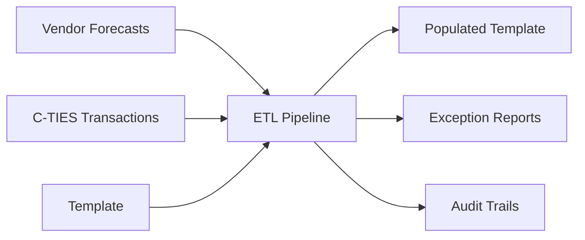
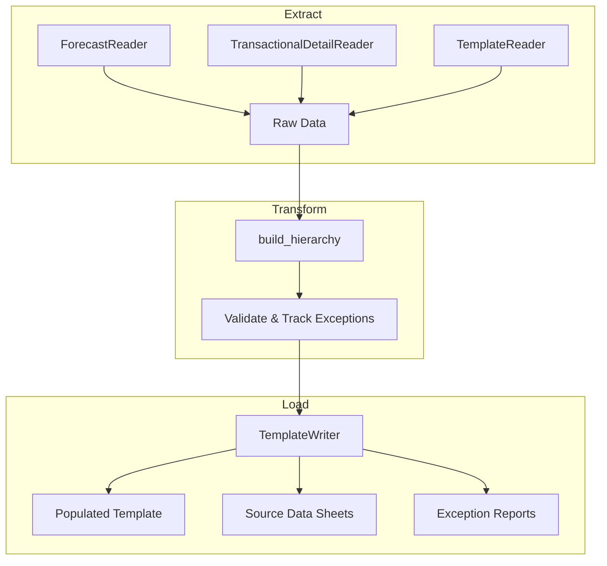
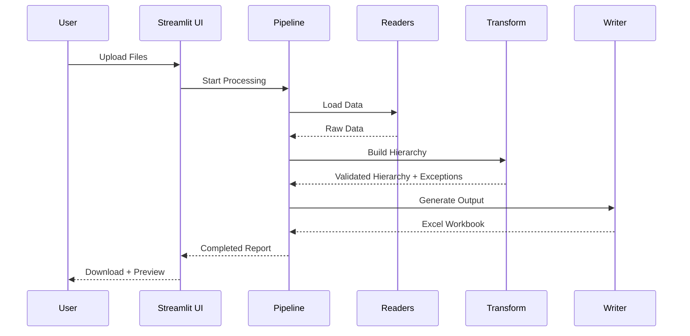

# Financial Automation Project

> **An end-to-end ETL pipeline for automating financial data processing with comprehensive exception tracking and data quality validation.**

[](https://www.python.org/downloads/)
[](https://streamlit.io)
[](LICENSE)

---

## 📋 Table of Contents

- [Overview](#overview)
- [Key Features](#key-features)
- [Quick Start](#quick-start)
- [Architecture](#architecture)
- [Documentation](#documentation)
- [Project Structure](#project-structure)
- [Key Outputs](#key-outputs)
- [Support](#support)

---

## 🎯 Overview

The Financial Automation Project automates the process of populating a Financial Spreadsheet Template with:
- **Forecast data** from vendor files
- **Actual data** from C-TIES transactional detail files
- **Comprehensive exception tracking** for data quality validation

This system eliminates manual data entry, reduces errors, and provides detailed audit trails and exception reports for financial analysis.

### What It Does



---

## ✨ Key Features

### 🔄 Automated Data Processing
- **Multi-source integration**: Combines vendor forecasts and transactional data
- **Intelligent parsing**: Automatically detects valid sheets and data structures
- **Duplicate handling**: Manages duplicate POs across multiple forecast files

### 🎨 User-Friendly Interface
- **Streamlit Web UI**: Easy-to-use interface for file uploads and report generation
- **Cost Center Filtering**: Process specific cost centers or all at once
- **Live Preview**: View generated reports before downloading
- **Configuration Management**: Adjust settings through the UI

### 📊 Comprehensive Exception Tracking
- **5 Exception Types**: Missing WBS, Missing PO, Duplicates, and more
- **Detailed Logging**: Full source row context for every exception
- **Summary Reports**: Executive overview of data quality issues
- **Interactive Filtering**: Filter exceptions by month, type, or cost center

### 🔍 Complete Audit Trail
- **Forecast Source Data**: Track all forecast values to source
- **Transaction Source Data**: Complete transactional detail audit
- **Exception Reports**: Detailed and summary views

### ⚙️ Flexible Configuration
- **YAML-based**: Easy-to-modify configuration files
- **Multiple Environments**: Support for different file formats and structures
- **Validation**: Built-in configuration validation

---

## 🚀 Quick Start

### Prerequisites

- Python 3.9 or higher
- pip package manager

### Installation

1. **Clone the repository**
   ```bash
   git clone <repository-url>
   cd financial-automation-project
   ```

2. **Install dependencies**
   ```bash
   pip install -r requirements.txt
   ```

### Usage Options

#### Option 1: Streamlit Web UI (Recommended)

```bash
streamlit run app.py
```

Then:
1. Upload your template file
2. Upload transactional detail file (C-TIES)
3. Upload one or more forecast files
4. (Optional) Select specific cost centers to process
5. Configure settings if needed
6. Click "Generate Report"
7. Preview and download your report

#### Option 2: Command Line

```bash
python main.py
```

Make sure to configure `configs/config_base.yaml` with your file paths first.

---

## 🏗️ Architecture

The system follows an **ETL (Extract, Transform, Load)** architecture:



### Core Components

| Component | Purpose |
|-----------|---------|
| **ForecastReader** | Reads vendor forecast files and extracts monthly forecast data |
| **TransactionalDetailReader** | Processes C-TIES files, categorizes transactions (Actual/Accrual/Reversal) |
| **TemplateReader** | Extracts cost centers and PO structure from template |
| **build_hierarchy** | Builds Cost Center → WBS → PO hierarchy with exception tracking |
| **TemplateWriter** | Generates output workbook with data and reports |

For detailed architecture documentation, see [docs/ARCHITECTURE.md](docs/ARCHITECTURE.md).

---

## 📚 Documentation

### For End Users
- **[User Guide](docs/USER_GUIDE.md)** - Complete guide for using the system
  - Streamlit UI walkthrough
  - Understanding outputs
  - Exception reports
  - Best practices

### For Administrators
- **[Configuration Guide](docs/CONFIGURATION.md)** - Complete configuration reference
  - All parameters explained
  - Configuration examples
  - Validation rules

### For Developers
- **[Architecture Guide](docs/ARCHITECTURE.md)** - System design and components
  - ETL pipeline details
  - Component interactions
  - Data models
  
- **[API Reference](docs/API_REFERENCE.md)** - Complete API documentation
  - All classes and methods
  - Code examples
  - Extension guide

### For Operations
- **[Deployment Guide](docs/DEPLOYMENT.md)** - Deployment and troubleshooting
  - Local and Azure deployment
  - Power Automate integration
  - Troubleshooting guide
  - FAQ

---

## 📁 Project Structure

```
financial-automation-project/
│
├── README.md                          # This file
├── requirements.txt                   # Python dependencies
├── .gitignore                         # Git ignore rules
│
├── app.py                             # Streamlit web application
├── main.py                            # Command-line entry point
├── streamlit_backend.py               # Backend orchestration for Streamlit
├── streamlit_config.py                # Configuration management for Streamlit
│
├── src/                               # Core source code
│   ├── __init__.py
│   ├── forecast_reader.py             # Vendor forecast file reader
│   ├── transactional_detail_reader.py # C-TIES file reader
│   ├── template_reader.py             # Template structure reader
│   ├── template_writer.py             # Output workbook writer
│   ├── models.py                      # Data models and exceptions
│   └── utils.py                       # Utility functions
│
├── configs/                           # Configuration files
│   ├── config_base.yaml               # Base configuration
│   └── config_streamlit.yaml          # Streamlit-specific config (created by UI)
│
├── data/                              # Sample data (not in repo)
│   ├── flowchart.png                  # Architecture diagram
│   └── template_output.xlsx           # Sample output
│
├── notebooks/                         # Jupyter notebooks for exploration
│   ├── exploring_data.ipynb
│   ├── template_reader.ipynb
│   └── test_new_inputs.ipynb
│
└── docs/                              # Comprehensive documentation
    ├── ARCHITECTURE.md                # System architecture and design
    ├── USER_GUIDE.md                  # End user documentation
    ├── CONFIGURATION.md               # Configuration reference
    ├── API_REFERENCE.md               # Developer API documentation
    └── DEPLOYMENT.md                  # Deployment and operations guide
```

---

## 📤 Key Outputs

The pipeline generates a comprehensive Excel workbook with multiple sheets:

### 1. Main Template (Populated)
- Forecast, Actual, Accrual, and Reversal data for each PO
- Organized by Cost Center → WBS → PO hierarchy
- Monthly breakdown (Jan-Dec)

### 2. Forecast Source Data
- Complete audit trail for all forecast values
- Links back to source files
- Filterable and sortable

### 3. Transactions Source Data
- Complete audit trail for all transactional data
- All C-TIES columns preserved
- Filterable by PO, month, type, etc.

### 4. Exceptions (Detailed)
- Row-by-row exception log
- Full source context for each exception
- Visible columns: Cost Center, Month, WBS, PO, Exception Type, Source Row, Amount, Type
- Hidden columns: Complete source row data (expandable)

### 5. Exceptions Summary
- Executive overview of data quality
- Exception counts by type (with percentages)
- Exception breakdown by cost center
- Interactive month filter

---

## 🔍 Exception Types

The system tracks five types of data quality exceptions:

| Exception Type | Description | Priority |
|----------------|-------------|----------|
| **MISSING_WBS_AND_PO** | Both WBS code and PO number are missing | Highest |
| **MISSING_WBS** | WBS code is missing | High |
| **MISSING_PO** | PO number is missing | High |
| **DUPLICATE_WBS** | WBS code appears under multiple cost centers | Medium |
| **DUPLICATE_PO** | PO appears under multiple WBS/cost center combinations | Medium |

For detailed exception documentation, see [docs/USER_GUIDE.md#exception-system](docs/USER_GUIDE.md#exception-system).

---

## 🔗 Power Automate Integration

The system integrates with Power Automate for end-to-end automation:

1. **User submits Microsoft Form** with file uploads
2. **Power Automate** converts files to base64 and calls Python pipeline (Azure-hosted)
3. **Pipeline processes** files and returns completed workbook
4. **Power Automate** uploads result to OneDrive/SharePoint
5. **User receives** notification with file link

For integration details, see [docs/DEPLOYMENT.md#power-automate-integration](docs/DEPLOYMENT.md#power-automate-integration).

---

## 🛠️ Configuration

The system uses YAML configuration files for flexibility:

- **`configs/config_base.yaml`** - Default configuration
- **`configs/config_streamlit.yaml`** - UI-created configuration (overrides base)

Key configuration sections:
- Template structure (header rows, columns, markers)
- Forecast reader (file paths, column mappings)
- Transactional detail reader (required columns, validation rules, column mappings)
- Template writer (output settings, source columns)

For complete configuration documentation, see [docs/CONFIGURATION.md](docs/CONFIGURATION.md).

---

## 📊 Data Flow



---

## 🤝 Support

### Getting Help

- **User Issues**: See [docs/USER_GUIDE.md](docs/USER_GUIDE.md)
- **Configuration Issues**: See [docs/CONFIGURATION.md](docs/CONFIGURATION.md)
- **Technical Issues**: See [docs/DEPLOYMENT.md#troubleshooting](docs/DEPLOYMENT.md#troubleshooting)
- **Development Questions**: See [docs/API_REFERENCE.md](docs/API_REFERENCE.md)

### Common Issues

| Issue | Solution |
|-------|----------|
| File not loading | Check file format and required columns |
| Configuration errors | Validate YAML syntax and required fields |
| Missing data | Check exception reports for data quality issues |
| Performance issues | Process fewer cost centers at once |

For detailed troubleshooting, see [docs/DEPLOYMENT.md#troubleshooting](docs/DEPLOYMENT.md#troubleshooting).

---

## 📝 License

Internal Pfizer project - All rights reserved

---

## 🎯 Next Steps

1. **New Users**: Start with the [User Guide](docs/USER_GUIDE.md)
2. **Administrators**: Review the [Configuration Guide](docs/CONFIGURATION.md)
3. **Developers**: Check out the [Architecture Guide](docs/ARCHITECTURE.md) and [API Reference](docs/API_REFERENCE.md)
4. **Operations**: See the [Deployment Guide](docs/DEPLOYMENT.md)

---

**Last Updated**: June 2026  
**Version**: 1.0  
**Maintained by**: Pfizer Financial Automation Team
