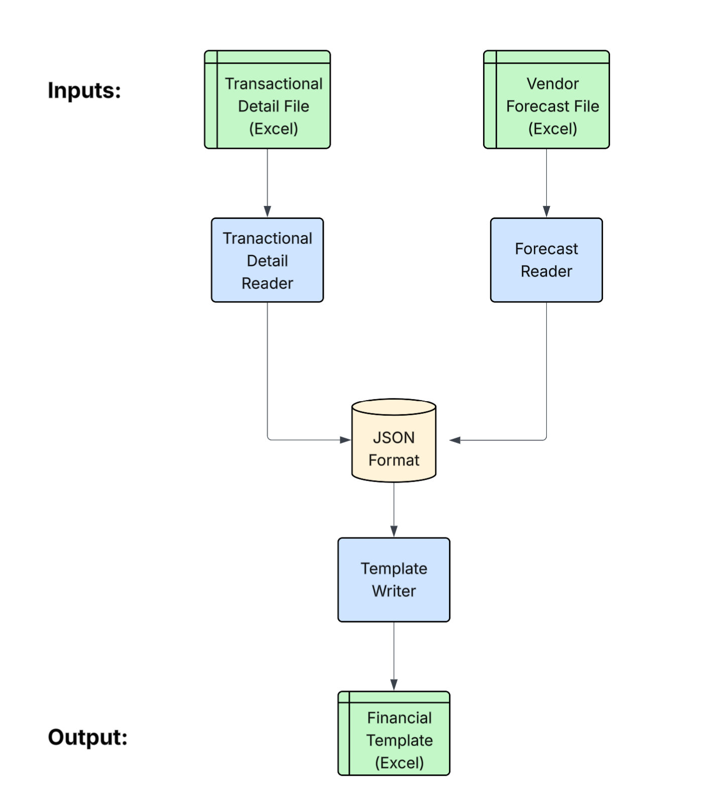

# financial-automation-project
This repository contains an end-to-end ETL pipeline for automating financial data processing. This project automates the process of populating a Financial Spreadsheet Template with forecast data from vendor files and actual data from a C-TIES file.

## Key Inputs:

1. Vendor Forecast File: Contains monthly forecasted fees for each PO.

2. Transactional Detail File (C-TIES): Actuals, accruals, reversals by accounting period.

3. Financial Spreadsheet Template: Target file for writing data.

## Key Outputs:

1. Populated Financial Spreadsheet Template: Populated with data from the two input spreadsheets (forecasts, accruals, actuals) 

## Project Strucure:

```
financial-automation/
│
├── data/                        # Sample input files
│   ├── template.xlsx
│   ├── vendor_forecast.xlsx
│   └── transactional_detail.xlsx
│
├── src/
│   ├── forecast_reader.py       # Reads vendor forecast file
│   ├── template_writer.py       # Writes data into template
│   ├── transactional_detail_reader.py  # Reads transactional detail file
|
|── main.py                  # Orchestrates the pipeline
|
└── README.md
```


## Pipeline Flow:

1. Read vendor forecast file, transactional detail file. 

2. Parse data, and store in JSON-like format

3. Combine data into singular JSON

4. Write to forecasting template and export


Below is a flowchart to visualize the full flow of the pipeline:



## Key Components:

The components can be grouped into three categories:

1. Readers (Extract)
2. Aggregators (Transform)
3. Writers (Load)

## 1. Readers (Extract):


### ForecastReader

This class reads vendor forecast files and stores forecast data in a dictionary with the following structure:

```
dict: { 'PO12345': 
    {'Jan': 
        {'Forecast': 1000, 'Source': [row_indices]}, 
    'Feb': 
        {'Forecast': 2000, 'Source': [row_indices]}, 
    ...
    } 
}
```
Note: Source refers to the row number in the forecast file from which the forecast value was pulled from. This is later used for auditability purposes.


### TransactionalDetailReader

This is a base class with the following two subclasses:

1. **InvoiceActualReader**: Reads transactional detail file and stores invoice actual data:
```
dict: {
    'PO12345': {
        'Jan': {'Actual': 900, 'Source': [row_indices]},
        'Feb': {...},
        ...
    },
    ...
}
```
2. **AccrualReader**: Extracts PO, monthly accruals, and monthly accrual reversals, including a 2WM boolean value 

```
dict: {
    'PO12345': {
        'Jan': {
            'Accrual': 950.0,
            'Accrual Reversal': 0.0,
            'Source': [indices_for_accrual],
            'ReversalSource': [indices_for_reversal],
            '2WM': True
        },
        'Feb': {
            'Accrual': 1000.0,
            'Accrual Reversal': -950.0,
            'Source': [indices_for_accrual],
            'ReversalSource': [indices_for_reversal],
            '2WM': False
        },
        ...
    },
    ...
}
```

**Transactional Detail File Rules:**

In order to accurately parse data from the transactional detail file, we have defined a list of classification criteria that can concretely define a row as either an invoice (actual), and accrual, or an accrual reversal. We have defined the rules to be the following:

1. If AP Voucher Number has a prefix of 5, the entry is an actual

2. If AP Voucher Number has a prefix of 2 and the value is positive, the entry is an accrual 

3. If AP Voucher Number has a prefix of 2 and the value is negaive, the entry is an accrual reversal

4. Otherwise, the entry is unclassified and is recorded on a separate sheet

## 2. Aggregators (Transform):

When we initially read the data, we have 3 separate dictionaries:
1. Forecast dict
2. Invoice Actual dict
3. Accrual/Accrual Reversal dict

This data needs to be aggregated to a singular JSON formatted dictionary so that it can be easily passed to our template writer. We do so with a helper function in main.py:

```python
#  Function to combine forecasts, actuals, and accrual data into one JSON formatted dictionary
def combine_data(forecast, actual, accrual):
    return combined_data
```

This function outputs a dictionary like the following:

```
dict: { 'PO12345': 
    {'Jan': 
        'Forecast': 1000,
        'Actual': 900,
        'Accrual': 950.0,
        'Accrual Reversal': 0.0,
        '2WM': True
    'Feb': 
        'Forecast': 1000,
        'Actual': 900,
        'Accrual': 950.0,
        'Accrual Reversal': -950.0,
        '2WM': False
    ...
    } 
}
```
This aggregated dictionary includes forecasts, actuals, accruals, and reversals in one place -- making it easier to write to our output file.


## 3. Writers (Load):

### Template Writer

We have defined an abstract base class TempalateWriter which gives a framework for writing to specific templates. We have implemented the following subclass:

**FinancialTemplateV2Writer:** Template writer based on 'Financial Spreadsheet Template v2.xlsx'

This class takes in a singular dictionary of data and writes to an output excel sheet, preserving the formatting in the specific template.

--------


## Power Automate Integration

While this python script will handle all the complex data processing, we will levereage Power Automate to orchestrate the entire pipeline, resulting in nearly full automation. Power Automate will handle triggering, file movement, and notifications, and Python will handle complex logic and Excel manipulation (which is hard to maintain in Power Automate alone). 

**Full Automation Flow:**

1. User submits form in microsoft teams
    - This form includes things like input file names (forecast and CTIES), as well as which template to be used
    - This form triggers a Power Automate flow

2. Power Automate gathers files from Microsoft Teams channel via SharePoint.

3. Power Automate then calls main.py, using the SharePoint files as input (hosted via Azure).

4. SharePoint (Output Files): The processed template is uploaded back to SharePoint via Power Automate.

5. Notification: Power Automate sends a completion message (via email or Teams) with a link to the updated file.


GL Line Description:
RC = reclass

-- 
Doc number starts w/ 9 & Cost Center starts w/ 7 = Travel Expense