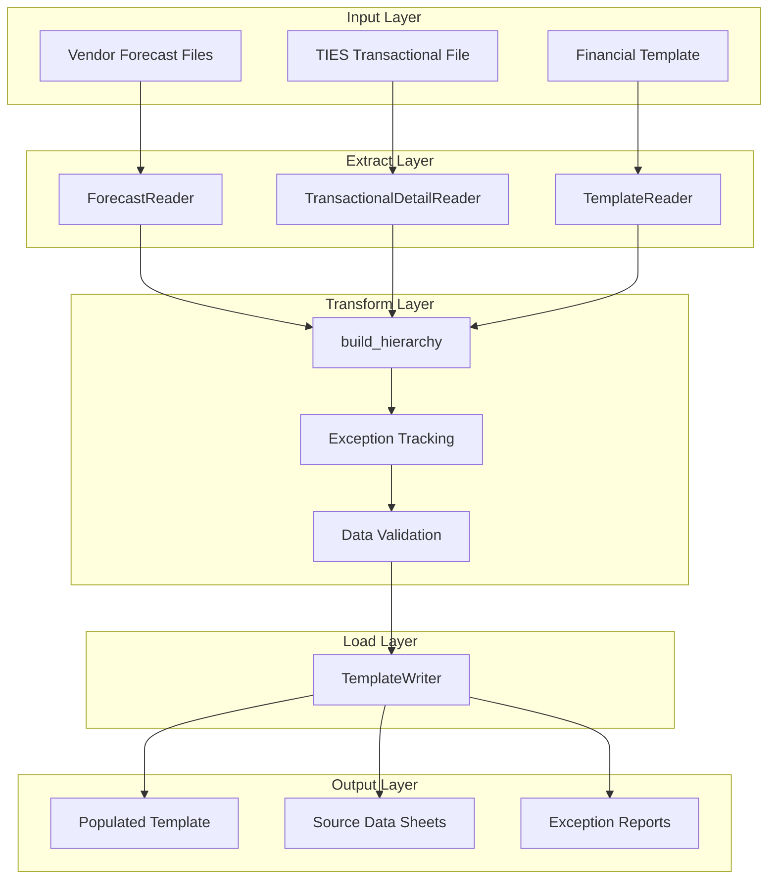
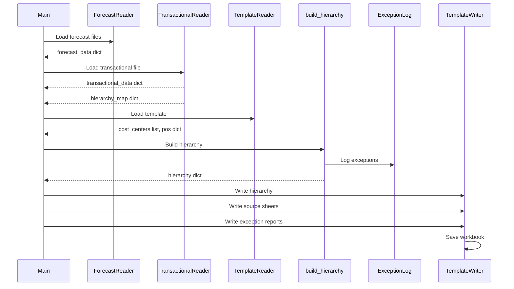
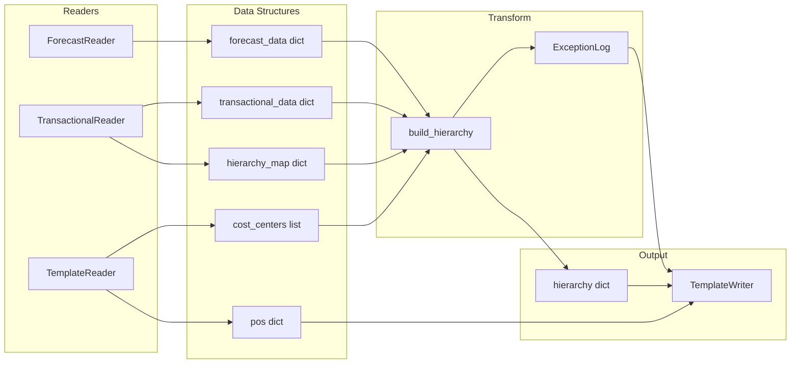

# Architecture Guide

> **Complete system architecture, component design, and data models for the Financial Automation Project**

---

##  Table of Contents

- [System Overview](#system-overview)
- [Architecture Patterns](#architecture-patterns)
- [ETL Pipeline](#etl-pipeline)
- [Core Components](#core-components)
- [Data Models](#data-models)
- [Component Interactions](#component-interactions)
- [Design Decisions](#design-decisions)
- [Extension Points](#extension-points)

---

##  System Overview

The Financial Automation Project is built on an **ETL (Extract, Transform, Load)** architecture that processes financial data from multiple sources and generates comprehensive reports with exception tracking.

### High-Level Architecture



### Key Characteristics

- **Modular Design**: Each component has a single, well-defined responsibility
- **Type Safety**: Extensive use of dataclasses and type hints
- **Exception-First**: Comprehensive exception tracking throughout the pipeline
- **Configuration-Driven**: YAML-based configuration for flexibility
- **Audit Trail**: Complete source data preservation for traceability

---

##  Architecture Patterns

### 1. ETL Pattern

The system follows the classic ETL pattern:

| Phase | Purpose | Components |
|-------|---------|------------|
| **Extract** | Read data from source files | ForecastReader, TransactionalDetailReader, TemplateReader |
| **Transform** | Build hierarchy, validate, track exceptions | build_hierarchy, ExceptionLog |
| **Load** | Write to output workbook | TemplateWriter |

### 2. Reader Pattern

All readers follow a consistent pattern:

```python
class Reader:
    def __init__(self, file_path, config_params):
        # Initialize with file path and configuration
        self.file_path = file_path
        self.data = None
    
    def load_data(self):
        # Load raw data from file
        pass
    
    def get_processed_data(self) -> dict:
        # Return processed, structured data
        pass
```

### 3. Dataclass Pattern

Immutable data structures using Python dataclasses:

```python
@dataclass
class Entity:
    required_field: str
    optional_field: Optional[str] = None
    collection: dict = field(default_factory=dict)
```

### 4. Exception Logging Pattern

Centralized exception tracking:

```python
exception_log = ExceptionLog()
exception_log.log(
    ExceptionType.MISSING_WBS,
    row_index=42,
    po="PO12345",
    cost_center="1234",
    source_row_data=full_row_dict
)
```

---

##  ETL Pipeline

### Pipeline Flow



### Data Flow

1. **Extract Phase**
   - ForecastReader: `file_paths`  `forecast_data` (dict)
   - TransactionalDetailReader: `file_path`  `transactional_data` (dict) + `hierarchy_map` (dict)
   - TemplateReader: `file_path`  `cost_centers` (list) + `pos` (dict)

2. **Transform Phase**
   - build_hierarchy: Combines all extracted data
   - Creates Cost Center  WBS  PO hierarchy
   - Validates data quality
   - Logs exceptions with full context

3. **Load Phase**
   - TemplateWriter: Writes hierarchy to template
   - Generates source data sheets
   - Creates exception reports
   - Saves final workbook

---

##  Core Components

### 1. ForecastReader

**Purpose**: Extract forecast data from vendor files

**Location**: `src/forecast_reader.py`

**Key Features**:
- Supports multiple forecast files
- Auto-detects valid sheets (must contain PO column and forecast columns)
- Handles duplicate POs across files (first occurrence wins)
- Aggregates multiple resources per PO

**Data Structure**:
```python
{
    'PO12345': {
        'Jan': {'Forecast': 1000.0, 'Source': [45, 46]},
        'Feb': {'Forecast': 2000.0, 'Source': [47]},
        # ... other months
    }
}
```

**Key Methods**:
- `_load_valid_sheet(file_path)`: Finds and loads the correct sheet
- `load_forecast()`: Loads all forecast files, handles duplicates
- `get_forecast_data()`: Returns structured forecast dictionary

**Processing Logic**:
1. Iterate through all provided file paths
2. For each file, find sheet with PO column and forecast columns (ending in "- FTotal")
3. Clean PO numbers (convert floats to strings)
4. Detect and handle duplicate POs across files
5. Group by PO and sum forecast values
6. Track source rows for audit trail

---

### 2. TransactionalDetailReader

**Purpose**: Extract and categorize transactional data from TIES files

**Location**: `src/transactional_detail_reader.py`

**Key Features**:
- Multi-sheet support (loads all valid sheets)
- Transaction categorization (Actual, Accrual, Reversal, Reclass)
- Month offset handling (actuals belong to prior month)
- Flexible column mapping via configuration

**Data Structure**:
```python
{
    'PO12345': {
        'cost_center': '1234',
        'wbs': 'IT-CT123',
        'Jan': {
            'Actual': 900.0,
            'Accrual': 950.0,
            'Reversal': 0.0
        },
        # ... other months
    }
}
```

**Transaction Classification Rules**:

| Classifier Prefix | Amount | Type |
|-------------------|--------|------|
| 5xx | Any | Actual (Invoice) |
| 2xx | Positive | Accrual |
| 2xx | Negative | Reversal (Accrual Reversal) |
| 9xx | Any | Reclass |
| Other | Any | Undefined |

**Key Methods**:
- `load_transactional_detail_file()`: Loads all valid sheets
- `_categorize_row(row)`: Classifies transaction type
- `get_transactional_data()`: Returns aggregated transaction data
- `get_hierarchy_map()`: Returns row-level mapping for hierarchy building

**Processing Logic**:
1. Load all sheets with required columns
2. Concatenate into single DataFrame
3. Apply transaction categorization
4. Filter to valid transaction types
5. Group by PO, Month, Type, Cost Center, WBS
6. Apply month offset for actuals (actuals in AP02 belong to Jan)
7. Return structured dictionary

---

### 3. TemplateReader

**Purpose**: Extract structure and PO mapping from template

**Location**: `src/template_reader.py`

**Key Features**:
- Extracts cost center list
- Maps PO numbers to row positions
- Configurable start rows and columns
- Stop marker detection

**Data Structure**:
```python
cost_centers = ['1234', '2345', '3456']
pos = {
    'PO12345': 17,  # Row number in template
    'PO67890': 18,
    # ...
}
```

**Key Methods**:
- `get_existing_cost_centers()`: Reads cost centers from template
- `get_existing_pos()`: Extracts PO-to-row mapping
- `_find_stop_row()`: Locates stop marker
- `_extract_pos_from_rows()`: Extracts POs between header and stop marker

**Processing Logic**:
1. Load template workbook
2. Read cost centers from configured column starting at configured row
3. Find stop marker row
4. Extract PO numbers between header row and stop marker
5. Create mapping of PO  row number

---

### 4. build_hierarchy (Transform Function)

**Purpose**: Build Cost Center  WBS  PO hierarchy with exception tracking

**Location**: `src/utils.py`

**Key Features**:
- Hierarchical data organization
- Comprehensive exception detection
- Duplicate detection across cost centers
- Full source row context preservation

**Hierarchy Structure**:
```python
{
    '1234': CostCenter(
        cost_center_id='1234',
        wbs_codes={
            'IT-CT123': WBSCode(
                wbs_code='IT-CT123',
                cost_center='1234',
                pos={
                    'PO12345': PO(
                        po_number='PO12345',
                        monthly_data={
                            'Jan': MonthlyMetrics(
                                forecast=1000.0,
                                actual=900.0,
                                accrual=950.0,
                                accrual_reversal=0.0
                            )
                        }
                    )
                }
            )
        }
    )
}
```

**Exception Detection Priority**:

1. **MISSING_WBS_AND_PO** (Highest) - Both identifiers missing
2. **MISSING_WBS** - WBS code missing
3. **MISSING_PO** - PO number missing
4. **DUPLICATE_WBS** - WBS appears under multiple cost centers
5. **DUPLICATE_PO** - PO appears under multiple WBS/cost center combinations

**Processing Logic**:
1. Pre-group rows by cost center
2. Pre-scan to identify duplicate WBS codes
3. For each cost center:
   - For each row in hierarchy_map:
     - Check for missing identifiers (log exceptions)
     - Check for duplicate WBS (log all occurrences)
     - Check for duplicate PO (log duplicates)
     - Build WBS and PO objects if valid
     - Fill monthly metrics from transactional data
     - Fill forecast from forecast data
4. Return complete hierarchy

---

### 5. TemplateWriter

**Purpose**: Generate output workbook with data and reports

**Location**: `src/template_writer.py`

**Key Features**:
- Writes hierarchy to template
- Generates source data sheets
- Creates exception reports
- Auto-sizing and formatting
- Column grouping for hidden data

**Output Sheets**:

1. **Main Template** (populated with data)
2. **Forecast Source Data** (audit trail)
3. **Transactions Source Data** (audit trail)
4. **Exception_Data** (hidden, for formulas)
5. **Exceptions** (detailed log)
6. **Exceptions Summary** (executive overview)

**Key Methods**:
- `write_hierarchy(hierarchy, pos)`: Writes financial data to template
- `write_forecast_source_sheet(df, pos)`: Creates forecast audit trail
- `write_transactional_source_sheet(df, pos)`: Creates transaction audit trail
- `write_exception_data_sheet(exception_log)`: Creates hidden data sheet
- `write_exception_sheet(exception_log, df)`: Creates detailed exception log
- `write_exception_summary_sheet(exception_log)`: Creates summary with interactive filter
- `save()`: Saves workbook to output path

**Column Mapping**:
```python
{
    'Jan': {
        'Accrual Reversal': 'N',
        'Forecast': 'O',
        'Accrual': 'P',
        'Actual': 'Q'
    },
    'Feb': {
        'Accrual Reversal': 'S',
        'Forecast': 'T',
        'Accrual': 'U',
        'Actual': 'V'
    },
    # ... continues for all months
}
```

---

##  Data Models

### Hierarchy Models

#### MonthlyMetrics
```python
@dataclass
class MonthlyMetrics:
    forecast: float = 0.0
    actual: float = 0.0
    accrual: float = 0.0
    accrual_reversal: float = 0.0
```

**Purpose**: Stores all financial metrics for a single month

---

#### PO
```python
@dataclass
class PO:
    po_number: str
    monthly_data: dict[str, MonthlyMetrics] = field(default_factory=dict)
```

**Purpose**: Represents a Purchase Order with monthly financial data

**Example**:
```python
po = PO(
    po_number='PO12345',
    monthly_data={
        'Jan': MonthlyMetrics(forecast=1000, actual=900, accrual=950, accrual_reversal=0),
        'Feb': MonthlyMetrics(forecast=2000, actual=1800, accrual=1900, accrual_reversal=-950)
    }
)
```

---

#### WBSCode
```python
@dataclass
class WBSCode:
    wbs_code: str
    cost_center: Optional[str] = None
    pos: dict[str, PO] = field(default_factory=dict)
```

**Purpose**: Represents a WBS Element containing multiple POs

**Example**:
```python
wbs = WBSCode(
    wbs_code='IT-CT123',
    cost_center='1234',
    pos={
        'PO12345': PO(...),
        'PO67890': PO(...)
    }
)
```

---

#### CostCenter
```python
@dataclass
class CostCenter:
    cost_center_id: str
    wbs_codes: dict[str, WBSCode] = field(default_factory=dict)
```

**Purpose**: Top-level container for WBS codes

**Example**:
```python
cc = CostCenter(
    cost_center_id='1234',
    wbs_codes={
        'IT-CT123': WBSCode(...),
        'IT-CT456': WBSCode(...)
    }
)
```

---

### Exception Models

#### ExceptionType
```python
class ExceptionType(Enum):
    MISSING_WBS_AND_PO = "MISSING_WBS_AND_PO"
    MISSING_WBS = "MISSING_WBS"
    MISSING_PO = "MISSING_PO"
    DUPLICATE_PO = "DUPLICATE_PO"
    DUPLICATE_WBS = "DUPLICATE_WBS"
```

**Purpose**: Enumeration of all exception types

---

#### ExceptionEntry
```python
@dataclass
class ExceptionEntry:
    exception_type: ExceptionType
    row_index: Optional[int] = None
    po: Optional[str] = None
    wbs: Optional[str] = None
    cost_center: Optional[str] = None
    month: Optional[str] = None
    amount: Optional[float] = None
    transaction_type: Optional[str] = None
    source_row_data: Optional[dict] = None
```

**Purpose**: Represents a single exception with full context

**Example**:
```python
entry = ExceptionEntry(
    exception_type=ExceptionType.MISSING_WBS,
    row_index=42,
    po='PO12345',
    cost_center='1234',
    month='Jan',
    amount=1000.0,
    transaction_type='Actual',
    source_row_data={'PO Number': 'PO12345', 'Vendor Name': 'IBM', ...}
)
```

---

#### ExceptionLog
```python
@dataclass
class ExceptionLog:
    entries: list[ExceptionEntry] = field(default_factory=list)
    
    def log(self, exception_type: ExceptionType, **kwargs):
        # Log new exception
        
    def summary(self):
        # Print summary to console
        
    def summary_by_type(self) -> dict:
        # Return counts by exception type
        
    def summary_by_cost_center(self) -> dict:
        # Return counts by cost center
        
    def summary_by_month(self) -> dict:
        # Return counts by month
```

**Purpose**: Central exception tracking and reporting

---

##  Component Interactions

### Data Flow Diagram



### Interaction Patterns

#### 1. Reader  Transform
```python
# Readers provide structured data
forecast_data = forecast_reader.get_forecast_data()
transactional_data = transactional_reader.get_transactional_data()
hierarchy_map = transactional_reader.get_hierarchy_map()

# Transform consumes all data
hierarchy = build_hierarchy(
    cost_centers=template_reader.cost_centers,
    hierarchy_map=hierarchy_map,
    transactional_data=transactional_data,
    forecast_data=forecast_data,
    exception_log=exception_log,
    transactional_df=transactional_reader.data
)
```

#### 2. Transform  Load
```python
# Writer receives hierarchy and exception log
template_writer.write_hierarchy(hierarchy, pos=template_reader.pos)
template_writer.write_exception_sheet(exception_log, transactional_reader.data)
template_writer.write_exception_summary_sheet(exception_log)
```

#### 3. Exception Tracking
```python
# Exceptions logged during transformation
exception_log.log(
    ExceptionType.MISSING_WBS,
    row_index=row_idx,
    po=po,
    cost_center=cc_id,
    month=month,
    amount=amount,
    transaction_type=trans_type,
    source_row_data=source_row_data
)

# Later retrieved for reporting
summary = exception_log.summary_by_type()
# {'counts': {'MISSING_WBS': 10, 'DUPLICATE_PO': 5}, 'total': 15, ...}
```

---

##  Design Decisions

### 1. Why ETL Architecture?

**Decision**: Use Extract-Transform-Load pattern

**Rationale**:
- **Separation of Concerns**: Each phase has distinct responsibilities
- **Testability**: Each component can be tested independently
- **Maintainability**: Easy to modify one phase without affecting others
- **Scalability**: Can parallelize extraction or add new data sources

**Trade-offs**:
- More complex than a single-pass approach
- Requires intermediate data structures
- Higher memory usage (all data in memory)

---

### 2. Why Dataclasses?

**Decision**: Use Python dataclasses for all data models

**Rationale**:
- **Type Safety**: Explicit types catch errors early
- **Immutability**: Default factory prevents shared mutable state
- **Readability**: Clear structure definition
- **IDE Support**: Better autocomplete and type checking

**Example**:
```python
# Clear, type-safe structure
@dataclass
class PO:
    po_number: str
    monthly_data: dict[str, MonthlyMetrics] = field(default_factory=dict)

# vs. unclear dictionary
po = {'po_number': 'PO123', 'monthly_data': {}}
```

---

### 3. Why Exception-First Design?

**Decision**: Track all data quality issues as exceptions

**Rationale**:
- **Transparency**: Users see all data quality problems
- **Audit Trail**: Full source context for every exception
- **Prioritization**: Exception types have priority order
- **Actionable**: Users can fix source data issues

**Implementation**:
- Exceptions logged during hierarchy building
- Full source row preserved for context
- Multiple report formats (detailed + summary)
- Interactive filtering in Excel

---

### 4. Why YAML Configuration?

**Decision**: Use YAML files for configuration

**Rationale**:
- **Human-Readable**: Easy to edit without code changes
- **Flexible**: Supports different file formats and structures
- **Version Control**: Configuration changes tracked in git
- **Environment-Specific**: Different configs for different scenarios

**Example**:
```yaml
template:
  header_row: 16
  po_col: "B"
  cost_center_col: "A"
```

---

### 5. Why Hierarchy Structure?

**Decision**: Organize data as Cost Center  WBS  PO

**Rationale**:
- **Matches Business Logic**: Reflects actual organizational structure
- **Natural Grouping**: Easy to filter by cost center
- **Exception Detection**: Can identify ownership conflicts
- **Reporting**: Enables cost center-level summaries

**Structure**:
```
Cost Center 1234
   WBS IT-CT123
       PO12345 (monthly data)
       PO67890 (monthly data)
   WBS IT-CT456
       PO11111 (monthly data)
```

---

##  Extension Points

### Adding New Exception Types

1. **Add to ExceptionType enum**:
```python
class ExceptionType(Enum):
    # Existing types...
    NEW_EXCEPTION = "NEW_EXCEPTION"
```

2. **Add detection logic in build_hierarchy**:
```python
if some_condition:
    exception_log.log(
        ExceptionType.NEW_EXCEPTION,
        row_index=row_idx,
        # ... other context
    )
```

3. **Exception automatically appears in reports** (no changes needed to writer)

---

### Adding New Data Sources

1. **Create new Reader class**:
```python
class NewDataReader:
    def __init__(self, file_path, config):
        self.file_path = file_path
        self.data = None
    
    def load_data(self):
        # Load from new source
        pass
    
    def get_processed_data(self) -> dict:
        # Return structured data
        pass
```

2. **Update build_hierarchy to consume new data**:
```python
def build_hierarchy(
    # ... existing params
    new_data: dict,  # Add new parameter
    # ...
):
    # Incorporate new data into hierarchy
    pass
```

3. **Update configuration** to include new data source settings

---

### Adding New Metrics

1. **Update MonthlyMetrics dataclass**:
```python
@dataclass
class MonthlyMetrics:
    forecast: float = 0.0
    actual: float = 0.0
    accrual: float = 0.0
    accrual_reversal: float = 0.0
    new_metric: float = 0.0  # Add new field
```

2. **Update TemplateWriter column mapping**:
```python
metrics = ["Accrual Reversal", "Forecast", "Accrual", "Actual", "New Metric"]
```

3. **Update data population logic** in build_hierarchy

---

### Customizing Transaction Classification

Modify `_categorize_row` in TransactionalDetailReader:

```python
def _categorize_row(self, row):
    classifier = str(row[self.colmap["classifier"]])
    amount = row[self.colmap["amount"]]
    
    # Add new classification rules
    if classifier.startswith("7"):
        return "Budget"
    elif classifier.startswith("8"):
        return "Forecast"
    
    # Existing rules...
```

---

##  Performance Considerations

### Memory Usage

- **All data loaded into memory**: Suitable for files up to ~100MB
- **Pandas DataFrames**: Efficient for tabular data
- **Dictionary structures**: Fast lookups during hierarchy building

### Optimization Opportunities

1. **Chunked Processing**: For very large files, process in chunks
2. **Parallel Reading**: Load multiple forecast files in parallel
3. **Lazy Loading**: Load data only when needed
4. **Caching**: Cache processed data for repeated runs

### Current Bottlenecks

- **Excel I/O**: Reading/writing Excel files is slowest operation
- **Hierarchy Building**: O(n) where n = number of transactional rows
- **Exception Logging**: Minimal overhead (simple list append)

---

##  Testing Strategy

### Unit Testing

Test each component independently:

```python
def test_forecast_reader():
    reader = ForecastReader(['test_forecast.xlsx'], po_col='PO #')
    data = reader.get_forecast_data()
    assert 'PO12345' in data
    assert data['PO12345']['Jan']['Forecast'] == 1000.0
```

### Integration Testing

Test component interactions:

```python
def test_pipeline():
    # Load all data
    forecast_data = forecast_reader.get_forecast_data()
    transactional_data = transactional_reader.get_transactional_data()
    
    # Build hierarchy
    hierarchy = build_hierarchy(...)
    
    # Verify structure
    assert '1234' in hierarchy
    assert 'IT-CT123' in hierarchy['1234'].wbs_codes
```

### End-to-End Testing

Test complete pipeline with sample data:

```python
def test_full_pipeline():
    # Run main.py with test config
    # Verify output file exists
    # Verify all sheets present
    # Verify data accuracy
```

---

##  Related Documentation

- **[User Guide](USER_GUIDE.md)** - How to use the system
- **[Configuration Guide](CONFIGURATION.md)** - Configuration reference
- **[API Reference](API_REFERENCE.md)** - Detailed API documentation
- **[Deployment Guide](DEPLOYMENT.md)** - Deployment and operations

---

**Last Updated**: June 2026  
**Version**: 1.0