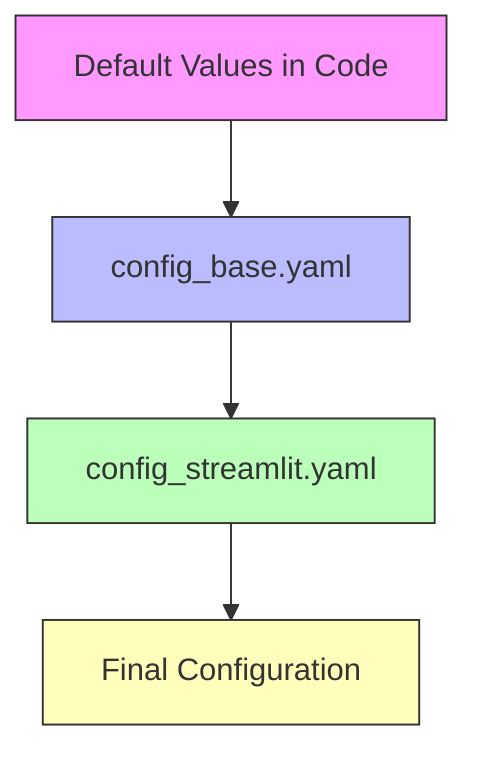

# Configuration Guide

> **Complete reference for configuring the Financial Automation Project**

---

## 📋 Table of Contents

- [Configuration Overview](#configuration-overview)
- [Configuration Files](#configuration-files)
- [Template Configuration](#template-configuration)
- [Forecast Reader Configuration](#forecast-reader-configuration)
- [Transactional Detail Reader Configuration](#transactional-detail-reader-configuration)
- [Template Writer Configuration](#template-writer-configuration)
- [Configuration Examples](#configuration-examples)
- [Validation Rules](#validation-rules)
- [Troubleshooting](#troubleshooting)

---

## 🎯 Configuration Overview

The Financial Automation Project uses **YAML-based configuration** for flexibility and maintainability.

### Configuration Philosophy

- **Human-Readable**: YAML format is easy to read and edit
- **Version Controlled**: Configuration changes tracked in git
- **Environment-Specific**: Different configs for different scenarios
- **Validated**: Built-in validation prevents errors
- **Flexible**: Adapt to different file formats without code changes

### Configuration Hierarchy



**Priority Order** (highest to lowest):
1. **config_streamlit.yaml** - Created by Streamlit UI (if exists)
2. **config_base.yaml** - Base configuration file
3. **Default values** - Hardcoded in code

---

## 📁 Configuration Files

### config_base.yaml

**Location**: `configs/config_base.yaml`

**Purpose**: Base configuration for command-line usage

**When to Use**:
- Running `main.py` from command line
- Automated workflows
- Default settings for new installations

**Example**:
```yaml
template:
  file_path: "data/templates/Ram 2026_Owen Testing.xlsx"
  header_row: 16
  po_col: "B"
  po_stop_marker: "Previous Period Invoices"
  cost_center_col: "A"
  cost_center_start_row: 9

forecast_reader:
  file_paths:
    - "data/forecasts/Other_Vendors_Forecasts.xlsx"
    - "data/forecasts/2026-Feb-IBM Forecast_AP02.xlsx"
  po_col: "PO #"

transactional_detail_reader:
  file_path: "data/transactional/TIES AP03 2026.xlsx"
  required_cols:
    - "PO Number"
    - "Month"
    - "GL Transaction Amount"
  valid_types:
    - "Actual"
    - "Accrual"
    - "Reversal"
  colmap:
    po: "PO Number"
    month: "Month"
    amount: "GL BER Corp Amount"
    classifier: "AP Voucher Number"
    cost_center: "Cost Center*"
    wbs: "WBS Element"
    type: "Type"

template_writer:
  output_path: "data/templates/template_AP03.xlsx"
  overwrite: False
  dec_acc_reversal_col: "N"
  forecast_source_cols:
    - "PO #"
    - "Jan 2026 - FTotal"
    - "Feb 2026 - FTotal"
    # ... (all months)
  transactional_source_cols:
    - "PO Number"
    - "Accounting Period"
    - "AP Voucher Number"
    # ... (all desired columns)
```

---

### config_streamlit.yaml

**Location**: `configs/config_streamlit.yaml`

**Purpose**: User-customized configuration from Streamlit UI

**When Created**:
- When user clicks "Save Configuration" in Streamlit UI
- Automatically used by Streamlit app if exists

**When to Use**:
- Custom settings for Streamlit UI
- User-specific configurations
- Testing different settings

**How to Reset**:
- Click "Reset to Defaults" in Streamlit UI
- Or manually delete the file

**Note**: File paths in this config are ignored by Streamlit (uses uploaded files instead)

---

## 🏗️ Template Configuration

Configuration for reading and writing the financial spreadsheet template.

### Parameters

#### file_path
```yaml
template:
  file_path: "data/templates/Ram 2026_Owen Testing.xlsx"
```

**Type**: String  
**Required**: Yes (for command-line usage)  
**Description**: Path to the Excel template file  
**Used By**: TemplateReader, TemplateWriter  
**Notes**: 
- Relative to project root
- Must be .xlsx format
- Ignored by Streamlit UI (uses uploaded file)

---

#### header_row
```yaml
template:
  header_row: 16
```

**Type**: Integer  
**Required**: Yes  
**Default**: 16  
**Description**: Row number where PO headers start (1-based)  
**Used By**: TemplateReader, TemplateWriter  
**Valid Range**: 1-1000  

**How to Find**:
1. Open template in Excel
2. Find row with "PO #" header
3. Note the row number (Excel row numbers are 1-based)

**Example**:
```
Row 15: [Some header]
Row 16: Cost Center | PO # | ... | Dec Acc Rev | Jan Forecast | ...  ← This is header_row
Row 17: 1234        | PO123| ...                                      ← Data starts here
```

---

#### po_col
```yaml
template:
  po_col: "B"
```

**Type**: String  
**Required**: Yes  
**Default**: "B"  
**Description**: Column letter containing PO numbers  
**Used By**: TemplateReader, TemplateWriter  
**Valid Format**: Single uppercase letter (A-Z) or two letters (AA-ZZ)  

**How to Find**:
1. Open template in Excel
2. Find column with PO numbers
3. Note the column letter

**Example**:
```
Column A: Cost Center
Column B: PO #          ← This is po_col
Column C: Description
```

---

#### po_stop_marker
```yaml
template:
  po_stop_marker: "Previous Period Invoices"
```

**Type**: String  
**Required**: Yes  
**Default**: "Previous Period Invoices"  
**Description**: Text marker indicating end of PO section  
**Used By**: TemplateReader  

**Purpose**: Tells the system where to stop reading PO numbers

**How to Find**:
1. Open template in Excel
2. Scroll down past all PO rows
3. Find the marker text in Column A
4. Use exact text (case-sensitive)

**Example**:
```
Row 45: 1234 | PO999 | ...
Row 46: 1234 | PO888 | ...
Row 47: Previous Period Invoices  ← This is the stop marker
Row 48: [Other content]
```

---

#### cost_center_col
```yaml
template:
  cost_center_col: "A"
```

**Type**: String  
**Required**: Yes  
**Default**: "A"  
**Description**: Column letter containing cost center IDs  
**Used By**: TemplateReader  
**Valid Format**: Single uppercase letter (A-Z) or two letters (AA-ZZ)  

---

#### cost_center_start_row
```yaml
template:
  cost_center_start_row: 9
```

**Type**: Integer  
**Required**: Yes  
**Default**: 9  
**Description**: Row number where cost centers start (1-based)  
**Used By**: TemplateReader  
**Valid Range**: 1-1000  

**How to Find**:
1. Open template in Excel
2. Find first row with a cost center ID in cost_center_col
3. Note the row number

**Example**:
```
Row 8:  [Header or blank]
Row 9:  1234              ← First cost center (cost_center_start_row)
Row 10: 2345              ← Second cost center
Row 11: 3456              ← Third cost center
```

---

## 📊 Forecast Reader Configuration

Configuration for reading vendor forecast files.

### Parameters

#### file_paths
```yaml
forecast_reader:
  file_paths:
    - "data/forecasts/Other_Vendors_Forecasts.xlsx"
    - "data/forecasts/2026-Feb-IBM Forecast_AP02.xlsx"
```

**Type**: List of Strings  
**Required**: Yes (for command-line usage)  
**Description**: Paths to one or more forecast files  
**Used By**: ForecastReader  
**Notes**:
- Can specify multiple files
- System combines data from all files
- Duplicate POs: First occurrence wins
- Ignored by Streamlit UI (uses uploaded files)

**Multiple Files Example**:
```yaml
forecast_reader:
  file_paths:
    - "data/forecasts/vendor1_forecast.xlsx"
    - "data/forecasts/vendor2_forecast.xlsx"
    - "data/forecasts/vendor3_forecast.xlsx"
```

---

#### po_col
```yaml
forecast_reader:
  po_col: "PO #"
```

**Type**: String  
**Required**: Yes  
**Default**: "PO #"  
**Description**: Column name in forecast files containing PO numbers  
**Used By**: ForecastReader  

**How to Find**:
1. Open forecast file in Excel
2. Find column with PO numbers
3. Note the exact column header text (case-sensitive)

**Common Variations**:
- "PO #"
- "PO Number"
- "Purchase Order"
- "PO"

---

## 📋 Transactional Detail Reader Configuration

Configuration for reading C-TIES transactional detail files.

### Parameters

#### file_path
```yaml
transactional_detail_reader:
  file_path: "data/transactional/TIES AP03 2026.xlsx"
```

**Type**: String  
**Required**: Yes (for command-line usage)  
**Description**: Path to C-TIES transactional detail file  
**Used By**: TransactionalDetailReader  
**Notes**:
- Single file only
- Must contain all required columns
- Ignored by Streamlit UI (uses uploaded file)

---

#### required_cols
```yaml
transactional_detail_reader:
  required_cols:
    - "PO Number"
    - "Month"
    - "GL Transaction Amount"
```

**Type**: List of Strings  
**Required**: Yes  
**Default**: ["PO Number", "Month", "GL Transaction Amount"]  
**Description**: Columns that must exist for a sheet to be considered valid  
**Used By**: TransactionalDetailReader  

**Purpose**: 
- Validates sheet structure
- Only sheets with all required columns are loaded
- Prevents loading incorrect sheets

**Minimum Required**:
- PO Number (or equivalent)
- Month/Period
- Amount

**Recommended**:
```yaml
required_cols:
  - "PO Number"
  - "Month"
  - "GL Transaction Amount"
  - "Cost Center*"
  - "WBS Element"
```

---

#### valid_types
```yaml
transactional_detail_reader:
  valid_types:
    - "Actual"
    - "Accrual"
    - "Reversal"
```

**Type**: List of Strings  
**Required**: Yes  
**Default**: ["Actual", "Accrual", "Reversal"]  
**Description**: Transaction types to include in processing  
**Used By**: TransactionalDetailReader  

**Available Types**:
- **Actual**: Invoices (AP Voucher starts with 5)
- **Accrual**: Accruals (AP Voucher starts with 2, positive amount)
- **Reversal**: Accrual reversals (AP Voucher starts with 2, negative amount)
- **Reclass**: Reclassifications (AP Voucher starts with 9)
- **Undefined**: Other transaction types

**To Include All Types**:
```yaml
valid_types:
  - "Actual"
  - "Accrual"
  - "Reversal"
  - "Reclass"
  - "Undefined"
```

---

#### colmap
```yaml
transactional_detail_reader:
  colmap:
    po: "PO Number"
    month: "Month"
    amount: "GL BER Corp Amount"
    classifier: "AP Voucher Number"
    cost_center: "Cost Center*"
    wbs: "WBS Element"
    type: "Type"
```

**Type**: Dictionary (key-value pairs)  
**Required**: Yes  
**Description**: Maps internal field names to actual column names in C-TIES file  
**Used By**: TransactionalDetailReader  

**Purpose**: Allows system to work with different column naming conventions

**Required Mappings**:

| Internal Key | Description | Example Value |
|--------------|-------------|---------------|
| `po` | PO number column | "PO Number" |
| `month` | Accounting period | "Month" |
| `amount` | Transaction amount | "GL BER Corp Amount" |
| `classifier` | Transaction classifier | "AP Voucher Number" |
| `cost_center` | Cost center ID | "Cost Center*" |
| `wbs` | WBS element | "WBS Element" |
| `type` | Transaction type | "Type" |

**Customization Example**:
If your C-TIES file has different column names:
```yaml
colmap:
  po: "Purchase Order Number"        # Instead of "PO Number"
  month: "Accounting Period"         # Instead of "Month"
  amount: "Transaction Amount"       # Instead of "GL BER Corp Amount"
  classifier: "Voucher ID"           # Instead of "AP Voucher Number"
  cost_center: "CC"                  # Instead of "Cost Center*"
  wbs: "WBS Code"                    # Instead of "WBS Element"
  type: "Type"                       # Usually stays the same
```

---

## 📝 Template Writer Configuration

Configuration for generating output workbook.

### Parameters

#### output_path
```yaml
template_writer:
  output_path: "data/templates/template_AP03.xlsx"
```

**Type**: String  
**Required**: Yes  
**Default**: "template_output.xlsx"  
**Description**: Path/filename for generated output file  
**Used By**: TemplateWriter  
**Valid Format**: Must end with .xlsx  

**Notes**:
- For command-line: Full path or relative to project root
- For Streamlit: Just filename (saved in temp directory)
- File will be created if doesn't exist
- Existing file overwritten if `overwrite: True`

---

#### overwrite
```yaml
template_writer:
  overwrite: False
```

**Type**: Boolean  
**Required**: Yes  
**Default**: False  
**Description**: Whether to overwrite existing data in template cells  
**Used By**: TemplateWriter  

**Behavior**:
- **False**: Only writes to empty cells (preserves existing data)
- **True**: Overwrites all cells with new data

**Use Cases**:
- **False**: Incremental updates, preserve manual entries
- **True**: Complete refresh, replace all data

---

#### dec_acc_reversal_col
```yaml
template_writer:
  dec_acc_reversal_col: "N"
```

**Type**: String  
**Required**: Yes  
**Default**: "N"  
**Description**: Column letter where December Accrual Reversal data starts  
**Used By**: TemplateWriter  
**Valid Format**: Single uppercase letter (A-Z) or two letters (AA-ZZ)  

**Purpose**: Reference point for calculating all other data columns

**How to Find**:
1. Open template in Excel
2. Find "Dec Acc Rev" or "December Accrual Reversal" column
3. Note the column letter

**Column Mapping Logic**:
Starting from `dec_acc_reversal_col`, the system maps:
```
Column N: Dec Accrual Reversal
Column O: Jan Forecast
Column P: Jan Accrual
Column Q: Jan Actual
Column R: [Skip]
Column S: Feb Accrual Reversal
Column T: Feb Forecast
... (continues for all months)
```

---

#### forecast_source_cols
```yaml
template_writer:
  forecast_source_cols:
    - "PO #"
    - "Jan 2026 - FTotal"
    - "Feb 2026 - FTotal"
    - "March 2026 - FTotal"
    - "April 2026 - FTotal"
    - "May 2026 - FTotal"
    - "June 2026 - FTotal"
    - "July 2026 - FTotal"
    - "Aug 2026 - FTotal"
    - "Sep 2026 - FTotal"
    - "Oct 2026 - FTotal"
    - "Nov 2026 - FTotal"
    - "Dec 2026 - FTotal"
```

**Type**: List of Strings  
**Required**: Yes  
**Description**: Columns to include in Forecast Source Data sheet  
**Used By**: TemplateWriter  

**Purpose**: 
- Defines visible columns in audit sheet
- Other columns automatically hidden but preserved

**Customization**:
- First column should be PO identifier
- Include all forecast columns you want visible
- Order determines display order
- Columns not listed will be hidden (but still present)

---

#### transactional_source_cols
```yaml
template_writer:
  transactional_source_cols:
    - "PO Number"
    - "Accounting Period"
    - "AP Voucher Number"
    - "Vendor Name"
    - "WBS Element"
    - "GL Invoice Date"
    - "GL Posting Date"
    - "GL Line Description"
    - "Description"
    - "GL Transaction Amount"
    - "GL BER Corp Amount"
    - "Month"
    - "AP01"
    - "AP02"
    - "AP03"
    - "Type"
```

**Type**: List of Strings  
**Required**: Yes  
**Description**: Columns to include in Transactions Source Data sheet  
**Used By**: TemplateWriter  

**Purpose**:
- Defines visible columns in audit sheet
- Other C-TIES columns automatically hidden but preserved

**Recommended Columns**:
- PO Number (identifier)
- Accounting Period
- Vendor information
- Amounts
- Dates
- Transaction type
- Period columns (AP01, AP02, etc.)

**Customization**:
```yaml
transactional_source_cols:
  - "PO Number"           # Always include
  - "Month"               # Always include
  - "Type"                # Always include
  - "GL BER Corp Amount"  # Always include
  - "Vendor Name"         # Optional but useful
  - "WBS Element"         # Optional but useful
  # Add any other columns you want visible
```

---

## 📚 Configuration Examples

### Example 1: Standard Configuration

**Scenario**: Standard template with default structure

```yaml
template:
  file_path: "data/templates/standard_template.xlsx"
  header_row: 16
  po_col: "B"
  po_stop_marker: "Previous Period Invoices"
  cost_center_col: "A"
  cost_center_start_row: 9

forecast_reader:
  file_paths:
    - "data/forecasts/all_vendors.xlsx"
  po_col: "PO #"

transactional_detail_reader:
  file_path: "data/transactional/cties_current.xlsx"
  required_cols:
    - "PO Number"
    - "Month"
    - "GL Transaction Amount"
  valid_types:
    - "Actual"
    - "Accrual"
    - "Reversal"
  colmap:
    po: "PO Number"
    month: "Month"
    amount: "GL BER Corp Amount"
    classifier: "AP Voucher Number"
    cost_center: "Cost Center*"
    wbs: "WBS Element"
    type: "Type"

template_writer:
  output_path: "data/output/monthly_report.xlsx"
  overwrite: False
  dec_acc_reversal_col: "N"
  forecast_source_cols:
    - "PO #"
    - "Jan 2026 - FTotal"
    - "Feb 2026 - FTotal"
    - "March 2026 - FTotal"
  transactional_source_cols:
    - "PO Number"
    - "Month"
    - "Type"
    - "GL BER Corp Amount"
```

---

### Example 2: Custom Template Structure

**Scenario**: Template with different row/column layout

```yaml
template:
  file_path: "data/templates/custom_template.xlsx"
  header_row: 20              # Headers start at row 20
  po_col: "C"                 # POs in column C
  po_stop_marker: "End of POs"  # Different marker text
  cost_center_col: "A"
  cost_center_start_row: 12   # Cost centers start at row 12

forecast_reader:
  file_paths:
    - "data/forecasts/forecast.xlsx"
  po_col: "Purchase Order"    # Different column name

transactional_detail_reader:
  file_path: "data/transactional/cties.xlsx"
  required_cols:
    - "PO Number"
    - "Month"
    - "GL Transaction Amount"
  valid_types:
    - "Actual"
    - "Accrual"
    - "Reversal"
  colmap:
    po: "PO Number"
    month: "Month"
    amount: "GL BER Corp Amount"
    classifier: "AP Voucher Number"
    cost_center: "Cost Center*"
    wbs: "WBS Element"
    type: "Type"

template_writer:
  output_path: "data/output/custom_output.xlsx"
  overwrite: True             # Overwrite existing data
  dec_acc_reversal_col: "P"   # Data starts at column P
  forecast_source_cols:
    - "Purchase Order"        # Match forecast file column name
    - "Jan 2026 - FTotal"
    - "Feb 2026 - FTotal"
  transactional_source_cols:
    - "PO Number"
    - "Month"
    - "Type"
    - "GL BER Corp Amount"
```

---

### Example 3: Multiple Forecast Files

**Scenario**: Combining forecasts from multiple vendors

```yaml
template:
  file_path: "data/templates/template.xlsx"
  header_row: 16
  po_col: "B"
  po_stop_marker: "Previous Period Invoices"
  cost_center_col: "A"
  cost_center_start_row: 9

forecast_reader:
  file_paths:
    - "data/forecasts/ibm_forecast.xlsx"
    - "data/forecasts/microsoft_forecast.xlsx"
    - "data/forecasts/oracle_forecast.xlsx"
    - "data/forecasts/other_vendors.xlsx"
  po_col: "PO #"

transactional_detail_reader:
  file_path: "data/transactional/cties.xlsx"
  required_cols:
    - "PO Number"
    - "Month"
    - "GL Transaction Amount"
  valid_types:
    - "Actual"
    - "Accrual"
    - "Reversal"
  colmap:
    po: "PO Number"
    month: "Month"
    amount: "GL BER Corp Amount"
    classifier: "AP Voucher Number"
    cost_center: "Cost Center*"
    wbs: "WBS Element"
    type: "Type"

template_writer:
  output_path: "data/output/consolidated_report.xlsx"
  overwrite: False
  dec_acc_reversal_col: "N"
  forecast_source_cols:
    - "PO #"
    - "Jan 2026 - FTotal"
    - "Feb 2026 - FTotal"
  transactional_source_cols:
    - "PO Number"
    - "Month"
    - "Type"
    - "GL BER Corp Amount"
```

---

### Example 4: Alternative Column Names

**Scenario**: C-TIES file with different column naming

```yaml
template:
  file_path: "data/templates/template.xlsx"
  header_row: 16
  po_col: "B"
  po_stop_marker: "Previous Period Invoices"
  cost_center_col: "A"
  cost_center_start_row: 9

forecast_reader:
  file_paths:
    - "data/forecasts/forecast.xlsx"
  po_col: "PO #"

transactional_detail_reader:
  file_path: "data/transactional/cties_alt_format.xlsx"
  required_cols:
    - "Purchase Order"        # Different name
    - "Period"                # Different name
    - "Amount"                # Different name
  valid_types:
    - "Actual"
    - "Accrual"
    - "Reversal"
  colmap:
    po: "Purchase Order"      # Map to actual column name
    month: "Period"           # Map to actual column name
    amount: "Amount"          # Map to actual column name
    classifier: "Voucher ID"  # Map to actual column name
    cost_center: "CC"         # Map to actual column name
    wbs: "WBS Code"           # Map to actual column name
    type: "Type"

template_writer:
  output_path: "data/output/output.xlsx"
  overwrite: False
  dec_acc_reversal_col: "N"
  forecast_source_cols:
    - "PO #"
    - "Jan 2026 - FTotal"
  transactional_source_cols:
    - "Purchase Order"        # Use actual column names
    - "Period"
    - "Type"
    - "Amount"
```

---

## ✅ Validation Rules

The system validates configuration to prevent errors.

### Template Validation

| Parameter | Rule | Error Message |
|-----------|------|---------------|
| `header_row` | Must be >= 1 | "Template header row must be >= 1" |
| `po_col` | Must be valid Excel column (A-ZZ) | "Invalid PO column: {value}" |
| `cost_center_col` | Must be valid Excel column (A-ZZ) | "Invalid cost center column: {value}" |
| `cost_center_start_row` | Must be >= 1 | "Cost center start row must be >= 1" |
| `po_stop_marker` | Cannot be empty | "PO stop marker cannot be empty" |

### Forecast Reader Validation

| Parameter | Rule | Error Message |
|-----------|------|---------------|
| `po_col` | Cannot be empty | "Forecast PO column name cannot be empty" |

### Transactional Detail Reader Validation

| Parameter | Rule | Error Message |
|-----------|------|---------------|
| `required_cols` | Must have at least one column | "At least one required column must be specified" |
| `valid_types` | Must have at least one type | "At least one valid type must be specified" |
| `colmap` values | Cannot be empty | "Transactional column mapping '{key}' cannot be empty" |

### Template Writer Validation

| Parameter | Rule | Error Message |
|-----------|------|---------------|
| `output_path` | Must end with .xlsx | "Output filename must end with .xlsx" |
| `dec_acc_reversal_col` | Must be valid Excel column | "Invalid Dec Acc Reversal column: {value}" |
| `forecast_source_cols` | Must have at least one column | "At least one forecast source column must be specified" |
| `transactional_source_cols` | Must have at least one column | "At least one transactional source column must be specified" |

---

## 🔧 Troubleshooting

### Common Configuration Issues

#### Issue: "Could not find stop marker"

**Cause**: `po_stop_marker` doesn't match text in template

**Solution**:
1. Open template in Excel
2. Find the actual marker text
3. Update configuration with exact text (case-sensitive)
```yaml
template:
  po_stop_marker: "Previous Period Invoices"  # Must match exactly
```

---

#### Issue: "No valid sheets found"

**Cause**: `required_cols` don't match actual column names in C-TIES file

**Solution**:
1. Open C-TIES file in Excel
2. Check actual column names (Row 2)
3. Update `required_cols` to match exactly
```yaml
transactional_detail_reader:
  required_cols:
    - "PO Number"              # Must match exactly
    - "Month"                  # Must match exactly
    - "GL Transaction Amount"  # Must match exactly
```

---

#### Issue: "Missing required columns"

**Cause**: `colmap` values don't match actual column names

**Solution**:
1. Open C-TIES file
2. Verify column names
3. Update `colmap` values
```yaml
transactional_detail_reader:
  colmap:
    po: "PO Number"           # Check actual name
    month: "Month"            # Check actual name
    amount: "GL BER Corp Amount"  # Check actual name
```

---

#### Issue: Data not appearing in output

**Cause**: `overwrite: False` and cells already have data

**Solution**:
- Set `overwrite: True` to replace existing data
- Or clear cells in template before running

```yaml
template_writer:
  overwrite: True  # Will overwrite existing data
```

---

#### Issue: Wrong columns in source sheets

**Cause**: Column names in config don't match actual file columns

**Solution**:
Update `forecast_source_cols` or `transactional_source_cols`:
```yaml
template_writer:
  forecast_source_cols:
    - "PO #"                  # Must match forecast file
    - "Jan 2026 - FTotal"     # Must match forecast file
```

---

## 📚 Related Documentation

- **[User Guide](USER_GUIDE.md)** - How to use the system
- **[Architecture Guide](ARCHITECTURE.md)** - System design
- **[API Reference](API_REFERENCE.md)** - For developers
- **[Deployment Guide](DEPLOYMENT.md)** - Troubleshooting

---

**Last Updated**: June 2026  
**Version**: 1.0