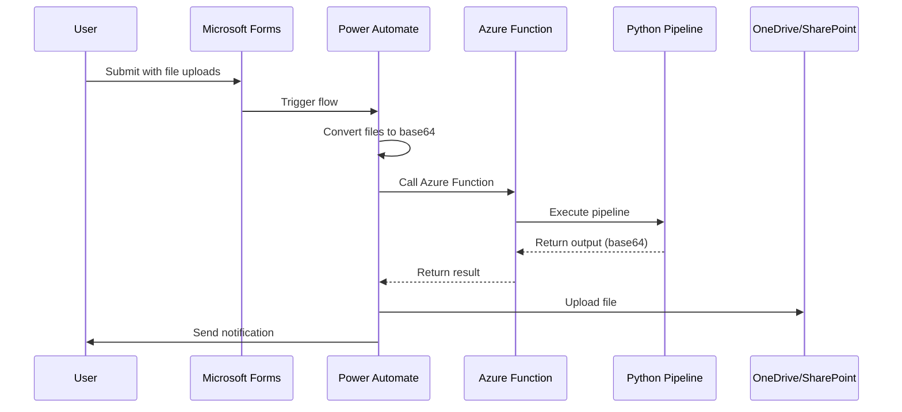

# Deployment & Operations Guide

> **Complete guide for deploying, integrating, and troubleshooting the Financial Automation Project**

---

##  Table of Contents

- [Local Deployment](#local-deployment)
- [Streamlit Deployment](#streamlit-deployment)
- [Power Automate Integration](#power-automate-integration)
- [Azure Deployment](#azure-deployment)
- [Troubleshooting](#troubleshooting)
- [Performance Optimization](#performance-optimization)
- [Maintenance](#maintenance)
- [FAQ](#faq)

---

##  Local Deployment

### Prerequisites

- Python 3.9 or higher
- 4GB RAM minimum (8GB recommended)
- 500MB free disk space
- Windows 10/11, macOS, or Linux

### Installation Steps

1. **Install Python**:
   - Download from [python.org](https://www.python.org/downloads/)
   - Verify installation:
     ```bash
     python --version  # Should show 3.9 or higher
     ```

2. **Clone/Download Project**:
   ```bash
   git clone <repository-url>
   cd financial-automation-project
   ```

3. **Create Virtual Environment** (recommended):
   ```bash
   # Windows
   python -m venv venv
   venv\Scripts\activate
   
   # Mac/Linux
   python3 -m venv venv
   source venv/bin/activate
   ```

4. **Install Dependencies**:
   ```bash
   pip install -r requirements.txt
   ```

5. **Verify Installation**:
   ```bash
   python -c "import pandas, openpyxl, streamlit; print('Installation successful!')"
   ```

### Running Locally

#### Option 1: Streamlit UI

```bash
streamlit run app.py
```

**Access**: Browser opens automatically to `http://localhost:8501`

**Features**:
- File upload interface
- Configuration management
- Live preview
- Download results

---

#### Option 2: Command Line

```bash
python main.py
```

**Requirements**:
- Configure `configs/config_base.yaml` with file paths
- Input files must be in specified locations

**Output**: Generated file at configured output path

---

### Environment Variables

Optional environment variables for configuration:

```bash
# Windows
set FINANCIAL_AUTOMATION_CONFIG=configs/config_custom.yaml
set FINANCIAL_AUTOMATION_OUTPUT_DIR=C:\output

# Mac/Linux
export FINANCIAL_AUTOMATION_CONFIG=configs/config_custom.yaml
export FINANCIAL_AUTOMATION_OUTPUT_DIR=/path/to/output
```

---

##  Streamlit Deployment

### Streamlit Cloud (Recommended)

**Step 1: Prepare Repository**

1. Push code to GitHub
2. Ensure `requirements.txt` is up to date
3. Add `.streamlit/config.toml` (optional):
   ```toml
   [theme]
   primaryColor = "#0066cc"
   backgroundColor = "#ffffff"
   secondaryBackgroundColor = "#f0f2f6"
   textColor = "#262730"
   font = "sans serif"
   
   [server]
   maxUploadSize = 200
   ```

**Step 2: Deploy to Streamlit Cloud**

1. Go to [share.streamlit.io](https://share.streamlit.io)
2. Sign in with GitHub
3. Click "New app"
4. Select repository and branch
5. Set main file path: `app.py`
6. Click "Deploy"

**Step 3: Configure**

- Set secrets if needed (Settings  Secrets)
- Configure resource limits
- Set up custom domain (optional)

**Limitations**:
- 1GB RAM limit
- File upload size limits
- Public by default (can make private with paid plan)

---

### Self-Hosted Streamlit

**Using Docker**:

1. **Create Dockerfile**:
   ```dockerfile
   FROM python:3.9-slim
   
   WORKDIR /app
   
   COPY requirements.txt .
   RUN pip install --no-cache-dir -r requirements.txt
   
   COPY . .
   
   EXPOSE 8501
   
   CMD ["streamlit", "run", "app.py", "--server.port=8501", "--server.address=0.0.0.0"]
   ```

2. **Build Image**:
   ```bash
   docker build -t financial-automation .
   ```

3. **Run Container**:
   ```bash
   docker run -p 8501:8501 financial-automation
   ```

**Using systemd (Linux)**:

1. **Create service file** `/etc/systemd/system/financial-automation.service`:
   ```ini
   [Unit]
   Description=Financial Automation Streamlit App
   After=network.target
   
   [Service]
   Type=simple
   User=appuser
   WorkingDirectory=/opt/financial-automation
   Environment="PATH=/opt/financial-automation/venv/bin"
   ExecStart=/opt/financial-automation/venv/bin/streamlit run app.py
   Restart=always
   
   [Install]
   WantedBy=multi-user.target
   ```

2. **Enable and start**:
   ```bash
   sudo systemctl enable financial-automation
   sudo systemctl start financial-automation
   ```

---

##  Power Automate Integration

### Overview

The system integrates with Microsoft Power Automate for end-to-end automation:



---

### Setup Steps

#### Step 1: Create Microsoft Form

1. Go to [Microsoft Forms](https://forms.microsoft.com)
2. Create new form: "Financial Report Generator"
3. Add fields:
   - **Template File** (File upload)
   - **Transactional Detail File** (File upload)
   - **Forecast Files** (File upload, allow multiple)
   - **Cost Centers** (Text, optional)
   - **Email** (Text, for notification)

#### Step 2: Create Power Automate Flow

1. **Trigger**: When a new response is submitted (Microsoft Forms)

2. **Get Response Details**: Get form response

3. **Get File Content** (for each uploaded file):
   - Template file
   - Transactional file
   - Forecast files (loop through)

4. **Convert to Base64**:
   ```
   base64(body('Get_file_content'))
   ```

5. **Call Azure Function**:
   - Method: POST
   - URI: `https://<your-function-app>.azurewebsites.net/api/process_financial_data`
   - Headers:
     ```json
     {
       "Content-Type": "application/json",
       "x-functions-key": "<your-function-key>"
     }
     ```
   - Body:
     ```json
     {
       "template": "@{base64(body('Get_template_file'))}",
       "transactional": "@{base64(body('Get_transactional_file'))}",
       "forecasts": [
         "@{base64(body('Get_forecast_file_1'))}",
         "@{base64(body('Get_forecast_file_2'))}"
       ],
       "cost_centers": "@{body('Get_response_details')?['r_cost_centers']}",
       "config": {
         "template": {
           "header_row": 16,
           "po_col": "B"
         }
       }
     }
     ```

6. **Parse JSON Response**:
   ```json
   {
     "type": "object",
     "properties": {
       "success": {"type": "boolean"},
       "output_file": {"type": "string"},
       "exceptions": {"type": "integer"},
       "message": {"type": "string"}
     }
   }
   ```

7. **Create File** (OneDrive/SharePoint):
   - File Name: `Financial_Report_@{utcNow()}.xlsx`
   - File Content: `base64ToBinary(body('Parse_JSON')?['output_file'])`

8. **Send Email**:
   - To: `@{body('Get_response_details')?['r_email']}`
   - Subject: "Financial Report Ready"
   - Body: Include file link and exception count

---

### Azure Function Code

**function_app.py**:
```python
import azure.functions as func
import logging
import json
import base64
import io
import sys
import os

# Add project to path
sys.path.insert(0, os.path.abspath(os.path.dirname(__file__)))

from src.forecast_reader import ForecastReader
from src.transactional_detail_reader import TransactionalDetailReader
from src.template_reader import TemplateReader
from src.template_writer import TemplateWriter
from src.utils import build_hierarchy, convert_base64
from src.models import ExceptionLog

app = func.FunctionApp()

@app.route(route="process_financial_data", auth_level=func.AuthLevel.FUNCTION)
def process_financial_data(req: func.HttpRequest) -> func.HttpResponse:
    logging.info('Processing financial data request')
    
    try:
        # Parse request
        req_body = req.get_json()
        
        # Convert base64 to file-like objects
        template_file = convert_base64(req_body['template'])
        transactional_file = convert_base64(req_body['transactional'])
        forecast_files = [convert_base64(f) for f in req_body['forecasts']]
        
        # Get configuration
        config = req_body.get('config', {})
        
        # Initialize readers
        forecast_reader = ForecastReader(
            file_paths=forecast_files,
            po_col=config.get('forecast_reader', {}).get('po_col', 'PO #')
        )
        
        transactional_reader = TransactionalDetailReader(
            file_path=transactional_file,
            required_cols=config.get('transactional_detail_reader', {}).get('required_cols', 
                ['PO Number', 'Month', 'GL Transaction Amount']),
            valid_types=config.get('transactional_detail_reader', {}).get('valid_types',
                ['Actual', 'Accrual', 'Reversal']),
            colmap=config.get('transactional_detail_reader', {}).get('colmap', {
                'po': 'PO Number',
                'month': 'Month',
                'amount': 'GL BER Corp Amount',
                'classifier': 'AP Voucher Number',
                'cost_center': 'Cost Center*',
                'wbs': 'WBS Element',
                'type': 'Type'
            })
        )
        
        template_reader = TemplateReader(
            file_path=template_file,
            header_row=config.get('template', {}).get('header_row', 16),
            po_col=config.get('template', {}).get('po_col', 'B'),
            po_stop_marker=config.get('template', {}).get('po_stop_marker', 
                'Previous Period Invoices'),
            cost_center_col=config.get('template', {}).get('cost_center_col', 'A'),
            cost_center_start_row=config.get('template', {}).get('cost_center_start_row', 9)
        )
        
        # Load data
        forecast_data = forecast_reader.get_forecast_data()
        transactional_data = transactional_reader.get_transactional_data()
        hierarchy_map = transactional_reader.get_hierarchy_map()
        
        # Build hierarchy
        exception_log = ExceptionLog()
        hierarchy = build_hierarchy(
            cost_centers=template_reader.cost_centers,
            hierarchy_map=hierarchy_map,
            transactional_data=transactional_data,
            forecast_data=forecast_data,
            exception_log=exception_log,
            transactional_df=transactional_reader.data
        )
        
        # Write output
        output_buffer = io.BytesIO()
        template_writer = TemplateWriter(
            file_path=template_file,
            output_path=output_buffer,
            overwrite=config.get('template_writer', {}).get('overwrite', False),
            header_row=config.get('template', {}).get('header_row', 16),
            po_column=config.get('template', {}).get('po_col', 'B'),
            dec_acc_reversal_col=config.get('template_writer', {}).get('dec_acc_reversal_col', 'N'),
            forecast_source_cols=config.get('template_writer', {}).get('forecast_source_cols', []),
            transactional_source_cols=config.get('template_writer', {}).get('transactional_source_cols', [])
        )
        
        template_writer.write_hierarchy(hierarchy, pos=template_reader.pos)
        template_writer.write_forecast_source_sheet(forecast_reader.data, pos=template_reader.pos)
        template_writer.write_transactional_source_sheet(transactional_reader.data, pos=template_reader.pos)
        template_writer.write_exception_data_sheet(exception_log)
        template_writer.write_exception_sheet(exception_log, transactional_reader.data)
        template_writer.write_exception_summary_sheet(exception_log)
        template_writer.save()
        
        # Convert output to base64
        output_buffer.seek(0)
        output_base64 = base64.b64encode(output_buffer.read()).decode('utf-8')
        
        # Return response
        return func.HttpResponse(
            json.dumps({
                'success': True,
                'output_file': output_base64,
                'exceptions': len(exception_log.entries),
                'message': f'Report generated successfully with {len(exception_log.entries)} exceptions'
            }),
            mimetype='application/json',
            status_code=200
        )
        
    except Exception as e:
        logging.error(f'Error processing request: {str(e)}')
        return func.HttpResponse(
            json.dumps({
                'success': False,
                'message': str(e)
            }),
            mimetype='application/json',
            status_code=500
        )
```

---

##  Azure Deployment

### Azure Function App Setup

**Step 1: Create Function App**

1. Go to [Azure Portal](https://portal.azure.com)
2. Create new Function App:
   - **Runtime**: Python 3.9
   - **Plan**: Consumption (pay-per-use) or Premium
   - **Region**: Choose closest to users

**Step 2: Configure Settings**

1. **Application Settings**:
   - `FUNCTIONS_WORKER_RUNTIME`: python
   - `PYTHON_VERSION`: 3.9
   - Add any custom environment variables

2. **Scale Settings** (if Premium plan):
   - Minimum instances: 1
   - Maximum instances: 10

**Step 3: Deploy Code**

**Option A: VS Code Extension**

1. Install Azure Functions extension
2. Right-click function folder
3. Select "Deploy to Function App"
4. Choose your function app

**Option B: Azure CLI**

```bash
# Login
az login

# Deploy
func azure functionapp publish <function-app-name>
```

**Option C: GitHub Actions**

Create `.github/workflows/deploy.yml`:
```yaml
name: Deploy to Azure Functions

on:
  push:
    branches: [ main ]

jobs:
  deploy:
    runs-on: ubuntu-latest
    steps:
    - uses: actions/checkout@v2
    
    - name: Setup Python
      uses: actions/setup-python@v2
      with:
        python-version: '3.9'
    
    - name: Install dependencies
      run: |
        python -m pip install --upgrade pip
        pip install -r requirements.txt
    
    - name: Deploy to Azure Functions
      uses: Azure/functions-action@v1
      with:
        app-name: ${{ secrets.AZURE_FUNCTIONAPP_NAME }}
        package: .
        publish-profile: ${{ secrets.AZURE_FUNCTIONAPP_PUBLISH_PROFILE }}
```

---

### Performance Considerations

**Memory Requirements**:
- Minimum: 512MB
- Recommended: 1GB
- Large files (>50MB): 2GB

**Timeout Settings**:
- Default: 5 minutes
- Recommended: 10 minutes
- Maximum: 30 minutes (Premium plan)

**Cold Start Mitigation**:
- Use Premium plan with always-on instances
- Or implement warming function:
  ```python
  @app.timer_trigger(schedule="0 */5 * * * *", arg_name="timer")
  def keep_warm(timer: func.TimerRequest):
      logging.info('Keeping function warm')
  ```

---

##  Troubleshooting

### Common Issues

#### Issue: "No module named 'src'"

**Cause**: Python can't find the src package

**Solutions**:
1. Ensure `src/__init__.py` exists
2. Run from project root directory
3. Add to PYTHONPATH:
   ```bash
   # Windows
   set PYTHONPATH=%PYTHONPATH%;C:\path\to\project
   
   # Mac/Linux
   export PYTHONPATH=$PYTHONPATH:/path/to/project
   ```

---

#### Issue: "Could not find stop marker"

**Cause**: Stop marker text doesn't match template

**Solutions**:
1. Open template in Excel
2. Find actual marker text
3. Update configuration:
   ```yaml
   template:
     po_stop_marker: "Previous Period Invoices"  # Must match exactly
   ```

---

#### Issue: "No valid sheets found"

**Cause**: Required columns missing from TIES file

**Solutions**:
1. Open TIES file
2. Check column names in Row 2
3. Update configuration:
   ```yaml
   transactional_detail_reader:
     required_cols:
       - "PO Number"      # Must match exactly
       - "Month"          # Must match exactly
       - "GL Transaction Amount"
   ```

---

#### Issue: "Memory Error" or "Out of Memory"

**Cause**: Large files exceed available memory

**Solutions**:
1. **Process fewer cost centers**:
   - Use cost center filtering in Streamlit UI
   - Or split into multiple runs

2. **Increase available memory**:
   - Close other applications
   - Use machine with more RAM
   - For Azure: Upgrade to Premium plan

3. **Optimize data**:
   - Remove unnecessary columns from source files
   - Limit to required accounting periods

---

#### Issue: Streamlit "Connection Error"

**Cause**: Port already in use or firewall blocking

**Solutions**:
1. **Use different port**:
   ```bash
   streamlit run app.py --server.port 8502
   ```

2. **Check firewall**:
   - Allow Python through firewall
   - Check corporate proxy settings

3. **Reset Streamlit**:
   ```bash
   streamlit cache clear
   ```

---

#### Issue: "Permission Denied" when saving file

**Cause**: File is open in Excel or insufficient permissions

**Solutions**:
1. Close file in Excel
2. Check file permissions
3. Use different output location
4. Run as administrator (Windows)

---

#### Issue: Incorrect data in output

**Cause**: Configuration mismatch or data quality issues

**Solutions**:
1. **Verify configuration**:
   - Check column mappings
   - Verify row numbers
   - Confirm stop marker

2. **Check exception reports**:
   - Open Exceptions Summary sheet
   - Review exception types
   - Fix source data issues

3. **Validate source data**:
   - Ensure PO numbers match across files
   - Check for missing WBS/PO assignments
   - Verify transaction classifications

---

### Debug Mode

Enable detailed logging:

**For Streamlit**:
```bash
streamlit run app.py --logger.level=debug
```

**For Command Line**:
Add to `main.py`:
```python
import logging
logging.basicConfig(level=logging.DEBUG)
```

**For Azure Functions**:
Set in `host.json`:
```json
{
  "logging": {
    "logLevel": {
      "default": "Debug"
    }
  }
}
```

---

##  Performance Optimization

### File Size Optimization

**Reduce Input File Sizes**:
1. Remove unnecessary columns
2. Limit to required date ranges
3. Remove formatting (use values only)
4. Compress files before upload

**Optimize Output**:
1. Limit source columns in configuration
2. Use hidden columns for less-used data
3. Consider splitting large reports

---

### Processing Speed

**Faster Processing**:
1. **Use SSD** for file storage
2. **Close other applications** to free RAM
3. **Process fewer cost centers** at once
4. **Use command line** instead of UI for large batches

**Batch Processing**:
```python
# Process cost centers in batches
cost_centers = template_reader.cost_centers
batch_size = 5

for i in range(0, len(cost_centers), batch_size):
    batch = cost_centers[i:i+batch_size]
    # Process batch
    hierarchy = build_hierarchy(
        cost_centers=batch,
        # ... other parameters
    )
    # Write output for batch
```

---

### Memory Management

**Monitor Memory Usage**:
```python
import psutil
import os

process = psutil.Process(os.getpid())
print(f"Memory usage: {process.memory_info().rss / 1024 / 1024:.2f} MB")
```

**Reduce Memory Footprint**:
1. Process data in chunks
2. Delete large objects when done:
   ```python
   del large_dataframe
   import gc
   gc.collect()
   ```
3. Use generators for large iterations

---

##  Maintenance

### Regular Tasks

**Weekly**:
- Review exception trends
- Check for new data quality issues
- Monitor processing times

**Monthly**:
- Update dependencies:
  ```bash
  pip list --outdated
  pip install --upgrade <package>
  ```
- Review and archive old output files
- Check disk space

**Quarterly**:
- Review configuration for changes
- Update documentation
- Test with new data formats

---

### Backup Strategy

**What to Backup**:
1. Configuration files (`configs/`)
2. Custom code modifications
3. Documentation updates
4. Sample/test data

**Backup Methods**:
1. **Git**: Commit and push regularly
2. **Cloud Storage**: OneDrive, SharePoint
3. **Local Backup**: External drive

**Backup Schedule**:
- After configuration changes
- Before major updates
- Weekly for active development

---

### Updates and Upgrades

**Updating Dependencies**:
```bash
# Check for updates
pip list --outdated

# Update specific package
pip install --upgrade pandas

# Update all packages (careful!)
pip install --upgrade -r requirements.txt

# Test after updates
python -m pytest tests/
```

**Updating Python Version**:
1. Install new Python version
2. Create new virtual environment
3. Install dependencies
4. Test thoroughly
5. Update documentation

---

##  FAQ

### General Questions

**Q: How long does processing take?**  
A: Typically 10-60 seconds depending on file sizes and number of cost centers. Large files (>50MB) may take 2-5 minutes.

**Q: What's the maximum file size?**  
A: Recommended maximum is 100MB per file. Larger files may cause memory issues.

**Q: Can I process multiple templates at once?**  
A: No, process one template at a time. For multiple templates, run the pipeline multiple times.

**Q: How many forecast files can I upload?**  
A: No hard limit, but 5-10 files is typical. More files increase processing time.

---

### Technical Questions

**Q: Does it work on Mac/Linux?**  
A: Yes, fully compatible with Windows, macOS, and Linux.

**Q: Can I run it without Streamlit?**  
A: Yes, use `python main.py` with configured `config_base.yaml`.

**Q: Is internet connection required?**  
A: No for local usage. Yes for Streamlit Cloud or Azure deployment.

**Q: Can I customize the output format?**  
A: Yes, modify `TemplateWriter` class or adjust configuration.

---

### Data Questions

**Q: What if my TIES file has different columns?**  
A: Update the `colmap` in configuration to match your column names.

**Q: How are actuals assigned to months?**  
A: Actuals in accounting period N belong to month N-1 (e.g., AP02 actuals  January).

**Q: What happens to duplicate POs?**  
A: First occurrence is used, duplicates logged as exceptions.

**Q: Can I exclude certain transaction types?**  
A: Yes, modify `valid_types` in configuration.

---

### Troubleshooting Questions

**Q: Why are some POs missing from output?**  
A: Check exception reports. Common causes: missing WBS, duplicate PO, or PO not in template.

**Q: Why is data different from source files?**  
A: Verify configuration (column mappings, row numbers). Check exception reports for data quality issues.

**Q: How do I fix "No valid sheets found"?**  
A: Ensure `required_cols` in configuration match actual column names in your file.

**Q: What if I get a Python error?**  
A: Check error message, verify file formats, ensure all dependencies installed. See troubleshooting section.

---

##  Support

### Getting Help

1. **Check Documentation**:
   - [User Guide](USER_GUIDE.md) - Usage questions
   - [Configuration Guide](CONFIGURATION.md) - Config issues
   - This guide - Deployment/technical issues

2. **Review Exception Reports**:
   - Often indicates data quality issues
   - Check Exceptions Summary sheet first

3. **Enable Debug Logging**:
   - Provides detailed error information
   - Helps identify root cause

4. **Contact Support**:
   - Include error messages
   - Provide sample files (if possible)
   - Describe steps to reproduce

---

##  Related Documentation

- **[README](../README.md)** - Project overview
- **[User Guide](USER_GUIDE.md)** - End user documentation
- **[Configuration Guide](CONFIGURATION.md)** - Configuration reference
- **[Architecture Guide](ARCHITECTURE.md)** - System design
- **[API Reference](API_REFERENCE.md)** - Developer documentation

---

**Last Updated**: June 2026  
**Version**: 1.0