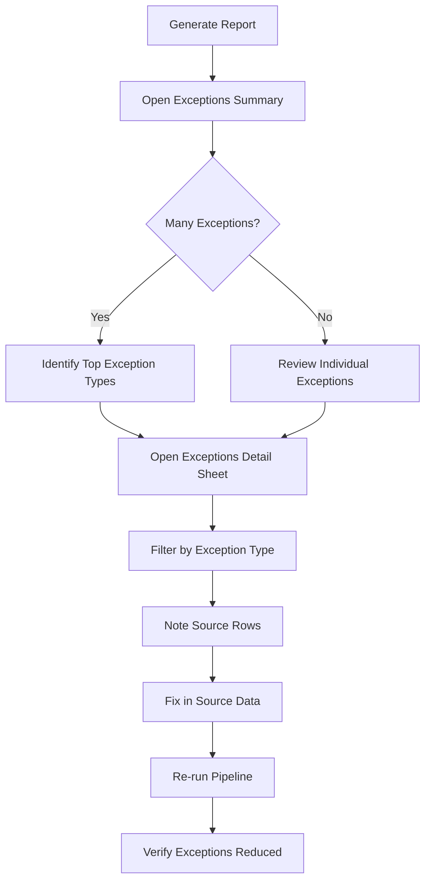

# User Guide

> **Complete guide for using the Financial Automation Project - from file preparation to report analysis**

---

##  Table of Contents

- [Getting Started](#getting-started)
- [Using the Streamlit Web UI](#using-the-streamlit-web-ui)
- [Using the Command Line](#using-the-command-line)
- [Input File Requirements](#input-file-requirements)
- [Understanding Outputs](#understanding-outputs)
- [Exception System Guide](#exception-system-guide)
- [Best Practices](#best-practices)
- [Common Workflows](#common-workflows)
- [Tips and Tricks](#tips-and-tricks)

---

##  Getting Started

### Prerequisites

Before you begin, ensure you have:

-  Python 3.9 or higher installed
-  Access to the project files
-  Your input files ready:
  - Financial spreadsheet template (.xlsx)
  - C-TIES transactional detail file (.xlsx)
  - One or more vendor forecast files (.xlsx)

### Installation

1. **Navigate to the project directory**:
   ```bash
   cd financial-automation-project
   ```

2. **Install required packages**:
   ```bash
   pip install -r requirements.txt
   ```

3. **Verify installation**:
   ```bash
   python -c "import streamlit; print('Ready to go!')"
   ```

---

##  Using the Streamlit Web UI

The Streamlit UI provides an intuitive interface for generating financial reports.

### Starting the Application

```bash
streamlit run app.py
```

Your browser will automatically open to `http://localhost:8501`

---

### Step-by-Step Walkthrough

#### Step 1: Upload Files


**Template File**:
- Click "Browse files" under "Template File"
- Select your financial spreadsheet template (.xlsx)
- System automatically extracts cost centers from the template
-  Success message shows number of cost centers found

**Transactional Detail File**:
- Click "Browse files" under "Transactional Detail File"
- Select your C-TIES file (.xlsx)
- Must contain required columns (PO Number, Month, GL Transaction Amount)

**Forecast Files**:
- Click "Browse files" under "Forecast Files"
- Select one or more vendor forecast files (.xlsx)
- Can upload multiple files at once
- System handles duplicate POs automatically (first occurrence wins)

---

#### Step 2: Select Cost Centers (Optional)

After uploading the template, you can filter which cost centers to process:

**Options**:
- **Process All**: Leave all cost centers selected (default)
- **Select Specific**: Uncheck cost centers you want to exclude
- **Add Custom**: Enter additional cost center IDs not in template

**Use Cases**:
- Testing with a single cost center
- Processing only changed cost centers
- Excluding problematic cost centers temporarily

**Example**:
```
Found 15 cost centers:
 1234
 2345
 3456  (unchecked - will be excluded)
 4567
...
```

---

#### Step 3: Configure Settings (Optional)

Click to expand "Configuration Settings" to adjust parameters:

**Template Settings**:
- Header Row: Row where PO headers start (default: 16)
- PO Column: Column containing PO numbers (default: B)
- Cost Center Column: Column with cost center IDs (default: A)

**Transactional Settings**:
- Required Columns: Columns that must exist
- Valid Types: Transaction types to process
- Column Mappings: Map column names to expected fields

**Writer Settings**:
- Output Filename: Name for generated file
- Overwrite: Allow overwriting existing data

 **Tip**: Default settings work for standard templates. Only adjust if your files have a different structure.

---

#### Step 4: Generate Report

1. **Verify Upload Status**:
   - All three file types should show green checkmarks
   - Cost center selection confirmed

2. **Click "Generate Report"**:
   - Progress bar shows pipeline stages
   - Status messages display current operation
   - Processing typically takes 10-60 seconds

3. **Monitor Progress**:
   ```
    Saving uploaded files...
    Step 1/4: Loading data...
    Loaded forecast data: 150 POs
    Loaded transactional data: 2,450 rows
    Step 2/4: Building hierarchy...
    Built hierarchy: 23 exceptions found
    Step 3/4: Writing template output...
    Step 4/4: Generating exception reports...
    Report generated successfully in 24.5 seconds!
   ```

---

#### Step 5: Review Exception Summary

After generation, an exception summary appears:

**Example**:
```
Exception Summary
Total Exceptions: 23

Breakdown by Type:
- MISSING_WBS: 12 (52.2%)
- DUPLICATE_PO: 8 (34.8%)
- MISSING_PO: 3 (13.0%)
```

**What to do**:
-  **0 exceptions**: Perfect! Your data is clean
-  **Few exceptions**: Review and fix if critical
-  **Many exceptions**: Check source data quality

---

#### Step 6: Preview Report

Before downloading, preview the generated report:

**Sheet Selector**:
- Choose which sheet to preview
- First sheet (main template): Shows 50 rows
- Other sheets: Show 10 rows

**Sheet Metadata**:
- Total Rows: Full row count
- Columns: Number of columns
- Preview Rows: How many rows shown

**Navigation**:
- Scroll horizontally to see all columns
- Use filters to find specific data
- Check data accuracy before downloading

---

#### Step 7: Download Report

1. **Click "Download Generated Report"**
2. **Save to your desired location**
3. **Open in Excel to view complete report**

**File Contents**:
- Main template with populated data
- Forecast source data sheet
- Transactions source data sheet
- Exception reports (detailed + summary)

---

### UI Features

#### Configuration Management

**Save Configuration**:
- Adjust settings in UI
- Click "Save Configuration"
- Settings saved to `configs/config_streamlit.yaml`
- Used for future sessions

**Reset to Defaults**:
- Click "Reset to Defaults"
- Confirm reset
- Deletes custom config file
- Returns to base configuration

**Configuration Status**:
-  "Using Custom Configuration" - Your saved settings active
-  "Using Default Configuration" - Base settings active

---

#### Cost Center Filtering

**Extract from Template**:
- Automatically reads cost centers when template uploaded
- Shows count: "Extracted 15 cost centers from template"

**Select/Deselect**:
- Use multiselect dropdown
- Select all or specific cost centers
- Shows selection summary: "Selected: 12 of 15 cost centers"

**Add Custom**:
- Enter cost center ID in text box
- Click "Add" button
- Useful for new cost centers not yet in template

---

#### Live Preview

**Benefits**:
- Verify data before downloading
- Check formatting and structure
- Spot issues early
- No need to download and re-upload

**Limitations**:
- Shows limited rows (50 for main sheet, 10 for others)
- Full data available in downloaded file
- Some Excel formatting may not display

---

##  Using the Command Line

For automated workflows or when UI is not available.

### Basic Usage

1. **Configure file paths** in `configs/config_base.yaml`:
   ```yaml
   template:
     file_path: "data/templates/your_template.xlsx"
   
   forecast_reader:
     file_paths:
       - "data/forecasts/vendor1_forecast.xlsx"
       - "data/forecasts/vendor2_forecast.xlsx"
   
   transactional_detail_reader:
     file_path: "data/transactional/cties_file.xlsx"
   
   template_writer:
     output_path: "data/output/result.xlsx"
   ```

2. **Run the pipeline**:
   ```bash
   python main.py
   ```

3. **Check output**:
   - Output file created at specified path
   - Console shows progress and exception summary
   - Review exception reports in output file

### Console Output

```
============
Step 1: Loading data

Loading valid sheets: ['AP01', 'AP02', 'AP03']
Successfully loaded transactional data from valid sheets.
Loaded forecast data

Step 2: Building hierarchy

Hierarchy map built: 2450 rows processed.
  - Missing PO:          15
  - Missing WBS:         8
  - Missing Cost Center: 0

Step 3: Writing template output

Workbook saved to: data/output/result.xlsx

Step 4: Writing exception reports

  MISSING_WBS: 12
  DUPLICATE_PO: 8
  MISSING_PO: 3
```

---

##  Input File Requirements

### Template File Requirements

**Format**: Excel (.xlsx)

**Required Structure**:
- Cost center column (default: Column A)
- PO number column (default: Column B)
- Header row with PO numbers (default: Row 16)
- Stop marker to indicate end of PO section (default: "Previous Period Invoices")
- Monthly data columns (Dec Accrual Reversal through Dec Actual)

**Example Structure**:
```
Row 9:  Cost Center | ...
Row 10: 1234        | ...
Row 11: 2345        | ...
...
Row 16: Cost Center | PO # | ... | Dec Acc Rev | Jan Forecast | Jan Accrual | Jan Actual | ...
Row 17: 1234        | PO123| ... | 0           | 1000         | 0           | 0          | ...
...
Row 50: Previous Period Invoices  (stop marker)
```

---

### Forecast File Requirements

**Format**: Excel (.xlsx)

**Required Columns**:
- PO column (default: "PO #")
- Monthly forecast columns ending in "- FTotal"
  - Example: "Jan 2026 - FTotal", "Feb 2026 - FTotal"

**Sheet Detection**:
- System automatically finds valid sheet
- Valid sheet must have both PO column and forecast columns
- If multiple sheets valid, uses first one found

**Example Structure**:
```
PO #    | Jan 2026 - FTotal | Feb 2026 - FTotal | ...
PO12345 | 1000             | 2000              | ...
PO67890 | 1500             | 1800              | ...
```

**Multiple Files**:
- Can provide multiple forecast files
- System combines data from all files
- Duplicate POs: First occurrence wins (warning displayed)

---

### Transactional Detail File Requirements

**Format**: Excel (.xlsx) from C-TIES

**Required Columns** (default names):
- PO Number
- Month (accounting period number)
- GL Transaction Amount
- GL BER Corp Amount
- AP Voucher Number (for classification)
- Cost Center*
- WBS Element
- Type (auto-generated by system)

**Sheet Detection**:
- Loads all sheets with required columns
- Header expected at Row 2 (Row 1 is title)
- Combines data from all valid sheets

**Transaction Types**:
System automatically categorizes based on AP Voucher Number:

| Voucher Prefix | Amount | Type |
|----------------|--------|------|
| 5xx | Any | Actual (Invoice) |
| 2xx | Positive | Accrual |
| 2xx | Negative | Reversal |
| 9xx | Any | Reclass |
| Other | Any | Undefined |

**Example Structure**:
```
Row 1: [Title Row]
Row 2: PO Number | Month | AP Voucher Number | GL BER Corp Amount | Cost Center* | WBS Element | ...
Row 3: PO12345   | 2     | 510123           | 1000              | 1234        | IT-CT123   | ...
Row 4: PO12345   | 2     | 210456           | 950               | 1234        | IT-CT123   | ...
```

---

##  Understanding Outputs

The system generates a comprehensive Excel workbook with 5 sheets:

### Sheet 1: Main Template (Populated)

**Purpose**: Your template with all financial data populated

**Structure**:
- Same layout as input template
- Data filled in monthly columns
- Organized by Cost Center  WBS  PO

**Columns** (per month):
- Accrual Reversal (Dec only)
- Forecast
- Accrual
- Actual

**Example**:
```
Cost Center | PO #    | ... | Jan Forecast | Jan Accrual | Jan Actual | Feb Forecast | ...
1234        | PO12345 | ... | 1000        | 950         | 900        | 2000        | ...
```

**Usage**:
- Primary output for financial analysis
- Use for reporting and planning
- Compare forecast vs actual
- Track accruals and reversals

---

### Sheet 2: Forecast Source Data

**Purpose**: Complete audit trail for forecast values

**Columns**:
- **Visible**: PO #, Monthly forecast columns
- **Hidden**: All other columns from source files (grouped, expandable)

**Features**:
- Filtered to POs in template only
- Auto-filter enabled
- Freeze panes at Row 2
- Total row with SUBTOTAL formulas
- Auto-sized columns

**Usage**:
- Verify forecast values
- Trace back to source files
- Audit forecast data
- Expand hidden columns for full context

**Example**:
```
PO #    | Jan 2026 - FTotal | Feb 2026 - FTotal | [Hidden: Resource, Vendor, etc.]
PO12345 | 1000             | 2000              | ...
PO67890 | 1500             | 1800              | ...
Total   | 2500             | 3800              |
```

---

### Sheet 3: Transactions Source Data

**Purpose**: Complete audit trail for transactional data

**Columns**:
- **Visible**: PO Number, Accounting Period, AP Voucher Number, Vendor Name, WBS Element, Amount, Month, Type
- **Hidden**: All other C-TIES columns (grouped, expandable)

**Features**:
- Filtered to POs in template only
- Auto-filter enabled
- Freeze panes at Row 2
- Auto-sized columns
- All transaction types included

**Usage**:
- Verify actual/accrual/reversal values
- Trace transactions to source
- Audit transactional data
- Investigate discrepancies

**Example**:
```
PO Number | Month | AP Voucher | Amount | Type     | [Hidden: GL Posting Date, etc.]
PO12345   | Jan   | 510123    | 1000   | Actual   | ...
PO12345   | Feb   | 210456    | 950    | Accrual  | ...
PO12345   | Feb   | 210789    | -950   | Reversal | ...
```

---

### Sheet 4: Exceptions (Detailed Log)

**Purpose**: Row-by-row exception log with full context

**Columns**:
- **Visible**:
  - Cost Center
  - Month
  - WBS
  - PO
  - Exception Type
  - Source Row (row number in C-TIES file)
  - Amount
  - Type (transaction type)
- **Hidden**: Complete source row data (all C-TIES columns)

**Features**:
- Auto-filter enabled
- Freeze panes at Row 2
- Auto-sized columns
- Hidden columns grouped and collapsible
- Sortable by any column

**Usage**:
- Identify specific data quality issues
- Filter by exception type
- Filter by cost center or month
- Expand hidden columns for full source context
- Use Source Row to find original data in C-TIES

**Example**:
```
Cost Center | Month | WBS      | PO      | Exception Type | Source Row | Amount | Type   | [Hidden...]
1234        | Jan   |          | PO12345 | MISSING_WBS   | 42        | 1000   | Actual | ...
2345        | Feb   | IT-CT123 |         | MISSING_PO    | 156       | 500    | Accrual| ...
```

---

### Sheet 5: Exceptions Summary

**Purpose**: Executive overview of data quality issues

**Features**:
- **Interactive Month Filter**: Dropdown to filter by month or view all
- **Summary by Type**: Count and percentage of each exception type
- **Summary by Cost Center**: Exception breakdown by cost center
- **Dynamic Formulas**: Updates when filter changes

**Section 1: Summary by Type**:
```
Exception Type        | Count | % of Total
MISSING_WBS          | 12    | 52.2%
DUPLICATE_PO         | 8     | 34.8%
MISSING_PO           | 3     | 13.0%
TOTAL                | 23    | 100.0%
```

**Section 2: Summary by Cost Center**:
```
Cost Center | Total | MISSING_WBS | DUPLICATE_PO | MISSING_PO
1234        | 15    | 10          | 5            | 0
2345        | 8     | 2           | 3            | 3
```

**Usage**:
- Quick overview of data quality
- Identify problematic cost centers
- Track exceptions by month
- Prioritize data cleanup efforts
- Report to stakeholders

---

##  Exception System Guide

### Understanding Exception Types

#### 1. MISSING_WBS_AND_PO (Highest Priority)

**Description**: Both WBS code and PO number are missing from a transaction row

**Impact**: 
- Transaction cannot be assigned to any cost center or PO
- Data is lost in the output

**Common Causes**:
- Incomplete data entry in C-TIES
- Data extraction issues
- Rows with only cost center information

**How to Fix**:
1. Open Exceptions sheet
2. Filter by "MISSING_WBS_AND_PO"
3. Note Source Row numbers
4. Find rows in original C-TIES file
5. Add missing WBS and PO information
6. Re-run pipeline

**Example**:
```
Row 42 in C-TIES:
Cost Center: 1234
WBS Element: [empty]
PO Number: [empty]
Amount: $1,000
 Exception logged, data excluded
```

---

#### 2. MISSING_WBS

**Description**: WBS code is missing but PO number exists

**Impact**:
- Cannot determine which WBS owns the PO
- PO data excluded from output

**Common Causes**:
- PO created without WBS assignment
- WBS field not populated in C-TIES
- Data sync issues

**How to Fix**:
1. Filter exceptions by "MISSING_WBS"
2. Identify affected POs
3. Look up correct WBS for each PO
4. Update C-TIES or source system
5. Re-run pipeline

**Example**:
```
Row 156 in C-TIES:
Cost Center: 1234
WBS Element: [empty]
PO Number: PO12345
Amount: $1,000
 Exception logged, PO excluded
```

---

#### 3. MISSING_PO

**Description**: PO number is missing but WBS code exists

**Impact**:
- Transaction cannot be assigned to specific PO
- Data excluded from output

**Common Causes**:
- Transactions without PO (manual entries)
- WBS-level charges
- Data entry errors

**How to Fix**:
1. Filter exceptions by "MISSING_PO"
2. Review transactions
3. Determine if PO should exist
4. If yes: Add PO number in source
5. If no: May need to handle differently (WBS-level reporting)

**Example**:
```
Row 89 in C-TIES:
Cost Center: 1234
WBS Element: IT-CT123
PO Number: [empty]
Amount: $500
 Exception logged, transaction excluded
```

---

#### 4. DUPLICATE_WBS

**Description**: WBS code appears under multiple cost centers

**Impact**:
- Ownership conflict
- All occurrences logged as exceptions
- First occurrence processed, others excluded

**Common Causes**:
- WBS transferred between cost centers
- Data entry errors
- Organizational changes

**How to Fix**:
1. Filter exceptions by "DUPLICATE_WBS"
2. Identify which cost center should own WBS
3. Update incorrect assignments in source
4. Re-run pipeline

**Example**:
```
WBS IT-CT123 appears in:
- Cost Center 1234 (10 transactions)
- Cost Center 2345 (5 transactions)
 All 15 transactions logged as exceptions
 First occurrence (CC 1234) processed
 Second occurrence (CC 2345) excluded
```

---

#### 5. DUPLICATE_PO

**Description**: PO appears under multiple WBS/cost center combinations

**Impact**:
- Ownership conflict
- First occurrence processed, duplicates excluded

**Common Causes**:
- PO reassigned between WBS codes
- Split POs across multiple WBS
- Data entry errors

**How to Fix**:
1. Filter exceptions by "DUPLICATE_PO"
2. Determine correct WBS/cost center for PO
3. Update incorrect assignments
4. Re-run pipeline

**Example**:
```
PO12345 appears in:
- CC 1234, WBS IT-CT123 (8 transactions)
- CC 1234, WBS IT-CT456 (3 transactions)
 All 11 transactions logged as exceptions
 First occurrence processed
 Duplicate excluded
```

---

### Using Exception Reports

#### Workflow for Exception Analysis



#### Step-by-Step Analysis

**1. Start with Summary**:
- Open "Exceptions Summary" sheet
- Review total exception count
- Identify most common exception types
- Check cost centers with most issues

**2. Filter by Month** (if needed):
- Use month dropdown filter
- Focus on specific accounting period
- Compare month-to-month trends

**3. Drill into Details**:
- Open "Exceptions" sheet
- Apply filters:
  - Exception Type
  - Cost Center
  - Month
  - PO or WBS

**4. Investigate Root Cause**:
- Note Source Row numbers
- Expand hidden columns for full context
- Open original C-TIES file
- Find corresponding rows
- Identify pattern or cause

**5. Document Findings**:
- Create list of issues
- Categorize by type and severity
- Prioritize fixes

**6. Fix Source Data**:
- Update C-TIES or source system
- Verify changes
- Re-export files

**7. Re-run and Verify**:
- Run pipeline with updated files
- Check exception count decreased
- Verify data accuracy in output

---

### Exception Best Practices

#### Prevention

 **Data Quality Checks**:
- Validate WBS and PO assignments before export
- Ensure all transactions have required fields
- Regular data audits

 **Consistent Processes**:
- Standard PO creation procedures
- WBS assignment guidelines
- Regular training

 **System Validation**:
- Enable required field validation in source systems
- Automated data quality checks
- Pre-export validation

#### Resolution

 **Prioritize by Impact**:
1. MISSING_WBS_AND_PO (highest impact)
2. MISSING_WBS / MISSING_PO
3. DUPLICATE_WBS / DUPLICATE_PO

 **Batch Fixes**:
- Group similar exceptions
- Fix in bulk when possible
- Document patterns

 **Track Progress**:
- Monitor exception trends over time
- Set reduction targets
- Celebrate improvements

---

##  Best Practices

### File Preparation

**Before Upload**:
1.  Verify file formats (.xlsx)
2.  Check file sizes (< 100MB recommended)
3.  Ensure required columns exist
4.  Remove any password protection
5.  Close files in Excel (avoid file locks)

**Template File**:
- Keep structure consistent
- Don't modify column positions
- Ensure stop marker is present
- Verify cost center list is current

**Forecast Files**:
- Use consistent column naming
- Include all months
- Verify PO numbers match template
- Check for duplicate POs across files

**Transactional File**:
- Export complete data (all columns)
- Include all accounting periods
- Verify AP Voucher Numbers are correct
- Check for missing WBS/PO assignments

---

### Processing Tips

**For Large Files**:
- Process one cost center at a time
- Split forecast files if very large
- Close other applications to free memory
- Use command line for better performance

**For Testing**:
- Start with single cost center
- Use small subset of data
- Verify configuration before full run
- Check exception reports carefully

**For Production**:
- Use consistent file naming
- Save configuration settings
- Document any custom settings
- Keep backup of input files

---

### Data Quality

**Regular Checks**:
- Review exception reports after each run
- Track exception trends over time
- Set data quality targets
- Address root causes, not symptoms

**Validation**:
- Compare totals to source files
- Spot-check random POs
- Verify month offsets (actuals in prior month)
- Check accrual/reversal pairs

**Documentation**:
- Document known issues
- Track fixes applied
- Maintain change log
- Share learnings with team

---

##  Common Workflows

### Workflow 1: Monthly Report Generation

**Frequency**: Monthly

**Steps**:
1. Export latest C-TIES file
2. Collect vendor forecast updates
3. Launch Streamlit UI
4. Upload all files
5. Select all cost centers
6. Generate report
7. Review exception summary
8. Download and distribute

**Time**: 5-10 minutes

---

### Workflow 2: Cost Center Deep Dive

**Frequency**: As needed

**Steps**:
1. Launch Streamlit UI
2. Upload files
3. Select single cost center
4. Generate report
5. Review exceptions in detail
6. Investigate issues
7. Fix source data
8. Re-run for verification

**Time**: 30-60 minutes

---

### Workflow 3: Exception Cleanup

**Frequency**: Weekly/Monthly

**Steps**:
1. Generate full report
2. Open Exceptions Summary
3. Identify top exception types
4. Open Exceptions detail sheet
5. Filter by exception type
6. Export exception list
7. Work with data owners to fix
8. Re-run to verify improvements

**Time**: 1-2 hours

---

### Workflow 4: Configuration Update

**Frequency**: When file formats change

**Steps**:
1. Launch Streamlit UI
2. Expand Configuration Settings
3. Update relevant parameters
4. Click "Save Configuration"
5. Test with sample files
6. Verify output accuracy
7. Document changes

**Time**: 15-30 minutes

---

##  Tips and Tricks

### UI Tips

 **Keyboard Shortcuts**:
- `Ctrl + R`: Refresh page
- `Ctrl + Shift + R`: Clear cache and refresh
- `Ctrl + Click`: Open links in new tab

 **File Upload**:
- Drag and drop files instead of browsing
- Upload multiple forecast files at once
- Files are temporarily stored (auto-cleanup)

 **Configuration**:
- Save configuration before closing browser
- Reset to defaults if issues occur
- Test configuration changes with small dataset

---

### Excel Tips

 **Exception Analysis**:
- Use Excel's filter and sort features
- Create pivot tables from exception data
- Use conditional formatting to highlight issues
- Copy exception list to separate workbook for tracking

 **Data Validation**:
- Use VLOOKUP to cross-reference POs
- Create summary tables by cost center
- Compare forecast vs actual with formulas
- Use charts to visualize trends

 **Audit Trail**:
- Keep source data sheets for reference
- Use hyperlinks to jump between sheets
- Document any manual adjustments
- Save versions with dates

---

### Performance Tips

 **Speed Up Processing**:
- Process fewer cost centers at once
- Close unnecessary applications
- Use SSD for file storage
- Increase available RAM if possible

 **Reduce File Size**:
- Remove unnecessary columns from source files
- Limit to required accounting periods
- Compress files before upload
- Archive old data

---

##  Getting Help

### Self-Service Resources

1. **Exception Reports**: Start here for data quality issues
2. **Configuration Guide**: For parameter questions
3. **Architecture Guide**: For technical understanding
4. **Troubleshooting Guide**: For common errors

### When to Escalate

-  System errors or crashes
-  Incorrect calculations
-  Missing data in output
-  Configuration not working
-  Performance issues

### What to Include

When reporting issues:
- Screenshot of error message
- Input file samples (if possible)
- Configuration settings used
- Steps to reproduce
- Expected vs actual behavior

---

##  Related Documentation

- **[Configuration Guide](CONFIGURATION.md)** - Complete configuration reference
- **[Architecture Guide](ARCHITECTURE.md)** - System design and components
- **[API Reference](API_REFERENCE.md)** - For developers
- **[Deployment Guide](DEPLOYMENT.md)** - Troubleshooting and FAQ

---

**Last Updated**: June 2026  
**Version**: 1.0